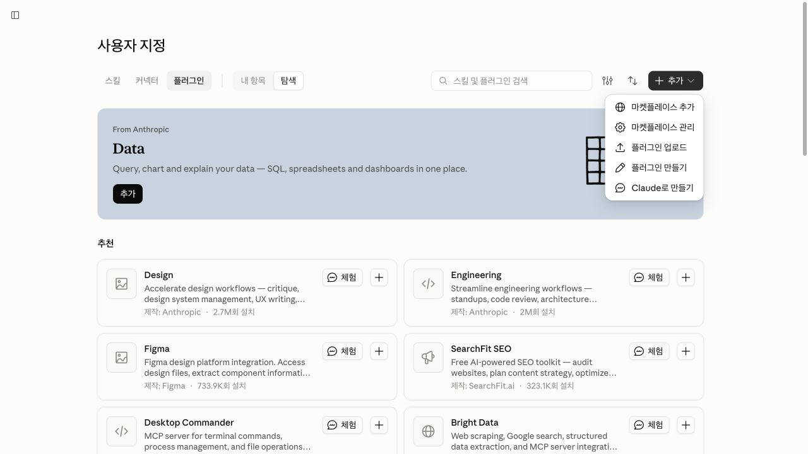
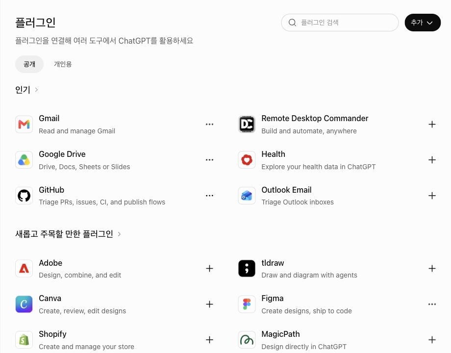

# 모두의 코워크 (MoAI-Cowork) — 한국 실무 AI 코워커 패밀리

> **비개발자도 한마디면 시작.** Claude Cowork와 ChatGPT Work 양쪽에서 쓰는, 한국 실무에 맞춘 AI 코워커(전문가) 패밀리입니다.

PM이 프로젝트 성격과 필요한 맥락을 확인하고, 업무에 맞는 전문 스킬과 진행 순서를 구성합니다. 설치·자료 접근·지침 적용·실제 실행 여부는 현재 앱에서 각각 확인합니다.

- **두 환경을 위한 패키지** — Claude와 OpenAI용 공통 `plugin.json`·`mcp.json`과 호환 매니페스트(`.claude-plugin` / `.codex-plugin`)를 제공합니다. ChatGPT Work와 로컬 Codex는 서로 다른 실행 환경이므로 설치 경로와 사용 가능한 기능을 따로 확인하세요.
- **한국 실무 설계** — 한국어 문서·말투·업무 규격(한글·HWPX·스마트스토어·공공데이터 등)에 맞췄습니다.
- **자연어로 업무 요청** — 목표와 자료를 설명하면 현재 사용할 수 있는 스킬을 업무에 맞게 선택하도록 안내합니다.
- **결과물은 여러분 것** — 상업적 사용 제한 없음. [LICENSE-OUTPUT.md](./LICENSE-OUTPUT.md)

---

## MoAI-Cowork가 무엇인가요?

MoAI-Cowork(모두의 코워크)는 **비개발자도 AI와 함께 실무를 풀 수 있게 만든 AI 코워커 패밀리**입니다.


"AI 코워커"는 한 가지 일에 깊이 특화된 전문가 AI입니다. 거대한 AI 하나가 모든 걸 다루는 게 아니라, 마케터·작가·셀러·법무 담당·디자이너처럼 **직무별로 나뉜 전문가 AI**가 각자의 영역을 맡습니다. 마치 회사에 부서가 있고 부서마다 담당자가 있는 것과 같습니다.

### 왜 만들었나요?

AI 도구는 강력하지만 "어떻게 시작하지?"에서 막히는 분이 많습니다.

- 영문 메뉴와 개발자 중심 인터페이스가 익숙하지 않은 분
- "뭘 입력해야 할지"를 매번 고민하게 되는 분
- 한국 실무 맥락(한글 문서, 스마트스토어, 공공데이터, 한국어 말투)을 잘 다루는 도구를 찾는 분

MoAI-Cowork는 하고 싶은 일과 가진 자료를 설명하는 것으로 시작합니다. PM이 필요한 정보를 질문하고, 프로젝트 기준과 스킬·역할·업무 순서를 정리합니다. [온라인 강의실](https://cowork.mo.ai.kr/learn/)에서 개념과 가상 실습을 함께 배울 수 있습니다.

### 핵심 특징

| 특징 | 설명 |
|------|------|
| **직무별 전문가 AI** | 코워커(범용)·작가·마케터·미디어·셀러·법무·재무·디자이너 등 각자의 영역을 맡은 코워커 패밀리 |
| **PM 허브가 진입 안내** | "새 프로젝트 시작해줘"로 목적을 파악하고 알맞은 코워커를 배치 |
| **두 앱의 환경 구분** | 같은 업무 기준을 사용하며 설치·파일 접근·도구 지원은 앱별로 확인 |
| **자연어 진입** | 목표·자료·완료 기준을 설명하고 필요한 스킬을 선택 |
| **한국 실무 정합** | 한국어 경어체, 한글 오피스 문서, 스마트스토어·공공데이터 등 국내 실무 규격 대응 |

---

## 어떻게 동작하나요?

처음에는 PM으로 프로젝트 기준을 준비합니다. 이후에는 이번 업무의 새 자료와 바뀐 조건을 제공하고 결과를 확인합니다.

### ① 최초 1회 — PM이 프로젝트를 준비합니다

"새 프로젝트 시작해줘"라고 말하면 PM이 목적과 산출물을 **인터뷰**로 묻습니다. 그 답에서 필요한 일을 **감지**해 알맞은 코워커와 스킬을 의존성에 맞춰 순차·병렬로 이은 **워크플로우**으로 조립합니다. 확인을 받으면 프로젝트 규칙 파일을 생성합니다.


마지막 "지침 생성" 단계에서 만들어지는 것은 다음과 같습니다.

- 프로젝트 지침 초안과 지원되는 로컬 지침 파일 — 로컬 정본 생성과 앱 Projects에 적용하는 단계를 구분합니다
- 프로젝트 전용 커스텀 에이전트와 스킬 체인 설계
- 필요한 경우 외부 서비스 API 키 안내

이 단계가 끝나면 "어떤 일을, 어떤 순서로, 어떤 품질 기준으로 만들지"가 한 번에 정리됩니다.

### ② 이후 매번 — 새 자료와 결과 기준을 알려 주세요

스킬 이름을 모두 외울 필요는 없습니다. 원하는 결과와 자료를 제공하고, 현재 사용할 수 있는 스킬로 업무를 진행하도록 요청합니다. 의존하는 작업은 순차로, 독립된 작업은 지원되는 경우 병렬로 진행하며 결과를 합쳐 검토합니다.


그림은 업무 분업의 개념도입니다. 실제 별도 에이전트가 실행되는지, 어떤 파일을 만들 수 있는지는 현재 환경에서 확인합니다.

> PM은 직접 일하지 않습니다. **누가 이 일에 맞는지 찾아 팀을 꾸리는 안내자** 역할만 합니다.

---

## AI 코워커 명단


전부 `modu-ai/moai-cowork` 마켓플레이스 하나에서 설치합니다. 정확한 최신 로스터는 [`.claude-plugin/marketplace.json`](.claude-plugin/marketplace.json)이 정본이고, 아래는 역할 요약입니다.

| 직무 | 플러그인 | 역할 |
|---|---|---|
| 🚀 **PM (진입 허브)** | `moai-pm` | `/project` 라우터 — 프로젝트 성격 파악 → 알맞은 코워커 배치 |
| 🧑‍💼 코워커 | `moai-coworker` | 범용 실무·라이프스타일 (협업·생산성·개인 일정) |
| ✍️ 작가 | `moai-writer` | 출판 기획·집필·한글 윤문·맞춤법 |
| 📖 스토리 크리에이터 | `moai-story` | 웹툰·웹소설·IP·스토리보드 |
| 📣 마케터 | `moai-marketer` | 캠페인·콘텐츠·광고·SEO·메타광고 |
| 🎬 미디어 크리에이터 | `moai-media` | 이미지·영상·오디오 생성 (Higgsfield·Midjourney·Gemini 등) |
| 🛒 셀러 | `moai-seller` | 커머스 운영 (스마트스토어·쿠팡·D2C·상세페이지·광고) |
| 📄 사무관 | `moai-officer` | 오피스 문서 (한글·워드·엑셀·PPT·PDF·노션) |
| 📊 데이터 애널리스트 | `moai-analyst` | 공공데이터·실거래가·경매·주식·통계 조회·시각화 |
| ⚖️ 법무 담당 | `moai-lawyer` | 계약 검토·컴플라이언스·특허·부동산 실명 |
| 💰 재무·세무 담당 | `moai-accountant` | 재무제표·세무·투자·보험·예산 |
| 🤝 인사·채용 담당 | `moai-recruiter` | 채용·이력서 검토·성과평가·인사 운영 |
| 🎧 CS매니저 | `moai-cs` | 고객응대·VOC·채널 메시지·티켓 분류 |
| 💼 컨설턴트 | `moai-consultant` | 전략·시장분석·정부지원금·스비즈365 |
| 🧭 커리어코치 | `moai-career` | 이력서·면접·포트폴리오·커리어 전환 |
| 🎓 튜터 | `moai-tutor` | 학습 자료·평가·논문·교육과정 |
| 🎨 디자이너 | `moai-designer` | 브랜드·로고·디자인 시스템·Claude Design 연동 |
| 📸 SNS 크리에이터 | `moai-threads-poster` | 소셜 발행 (Threads·Instagram) |

코워커별 상세 소개는 [AI 코워커](https://cowork.mo.ai.kr/moai-agents/)에서 볼 수 있습니다.

---

## 시작하기 — 현재 앱에서 설치 경로 확인

**Claude Cowork**와 **ChatGPT Work** 중 사용할 환경을 정하고 계정·조직이 제공하는 플러그인 설치 경로를 확인합니다. 외부 서비스 연결 없이 가상 메모로 첫 실습을 시작할 수도 있습니다.


### 1. 마켓플레이스 등록 (최초 1회)

마켓플레이스는 설치할 수 있는 코워커 목록입니다. 사용하는 앱의 경로로 등록합니다.

- **Claude Cowork**: 현재 사용자 지정의 플러그인 화면에서 마켓플레이스 추가 또는 지원되는 패키지 경로를 확인합니다. 저장소 추가가 제공되면 `modu-ai/moai-cowork`를 지정합니다.
- **ChatGPT Work**: Plugins에서 제공되는 설치 경로를 확인합니다. MoAI가 공용 목록에 없으면 사용자 지정 마켓플레이스나 조직 배포를 지원하는지 확인합니다. 모든 개인 계정에 GitHub 가져오기가 있다고 가정하지 않습니다.



> 앱별 정확한 클릭 경로와 잘 안 될 때 대처법은 [플러그인 설치와 관리](https://cowork.mo.ai.kr/plugins/install/) 1절에 정리해 두었습니다.

### 2. 코워커(플러그인) 설치

현재 앱에서 제공하는 플러그인 경로로 필요한 코워커를 설치합니다. 외부 서비스 연결은 플러그인 설치와 별도로 인증하며, 설치 후 현재 작업에 기능이 노출되는지 확인합니다.

- **먼저 `moai-pm`** — "새 프로젝트 시작해줘"로 프로젝트를 초기화하고 나머지 코워커를 배치하는 진입 허브입니다.
- **함께 권장 `moai-coworker`** — 텍스트 산출물 검수 등 범용 실무 코어를 담습니다.
- 그 다음엔 진행할 작업에 맞는 직무 코워커를 골라 추가하면 됩니다. 예: 마케팅·콘텐츠 작업은 `moai-marketer`, 법무·문서 작업은 `moai-lawyer`·`moai-officer`.



> 처음에는 할 업무의 역할 하나부터 선택하거나 PM으로 계획을 구성합니다. 추천 기능과 실제 설치·실행된 기능을 구분합니다. 위 사진은 웹 탐색 화면이며 MoAI 설치 성공을 증명하는 사진은 아닙니다.

### 3. 프로젝트 시작

사용하는 앱에서 프로젝트를 열고 "온라인 클래스 런칭 준비 프로젝트 시작해줘"처럼 목적을 말합니다. `/project`가 현재 앱에서 제공되면 그 진입점도 사용할 수 있습니다.

PM은 기존 자료와 필요한 맥락을 확인하고, 전문 스킬·역할·순차/병렬 워크플로우를 설계합니다. 실제 답과 대기 질문은 `.moai/config.json`·`.moai/context.md`에 보존합니다.

| 프로젝트 환경 | 지침 적용 |
|---|---|
| ChatGPT 계정의 Projects / Work | 해당 Project의 지침·파일 경로로 적용하고 새 대화에서 읽기와 스킬 노출을 확인 |
| 로컬 / Synced Work | 연결된 폴더와 실행 위치를 확인한 뒤 실제 지원되는 지침 경로로 적용 |
| Claude Projects / Cowork | 현재 앱의 Project 지침 또는 허용된 폴더 경로로 적용하고 새 작업에서 확인 |
| 로컬 Codex / Claude Code | 지원되는 `AGENTS.md` 발견 또는 `CLAUDE.md` import 경로를 확인 |

로컬 파일을 만든 상태와 Project에서 읽힌 상태를 따로 기록합니다. 하위 에이전트는 현재 호스트가 지원하고 분업이 허용된 경우에 생성·호출합니다. 대표 업무를 실행해 산출물까지 검증한 뒤 작업 완료를 판단합니다. 적용 경로는 [OpenAI 프로젝트 지침](https://learn.chatgpt.com/docs/agent-configuration/agents-md)과 [Claude 프로젝트 안내](https://support.claude.com/en/articles/9517075-what-are-projects)를 참고하세요.

단계별 전체 가이드는 [빠른 시작](https://cowork.mo.ai.kr/getting-started/quick-start/)을 보세요.

---

## 문서 사이트 — 무엇이 어디에 있나

문서 사이트 [cowork.mo.ai.kr](https://cowork.mo.ai.kr)는 비개발자(10~60대)를 위한 한국어 Claude Cowork·ChatGPT Work 실무 가이드입니다. 목차의 진실 출처(SSOT)는 [`www/data/menu/main.yaml`](www/data/menu/main.yaml)이고, 아래는 그 요약입니다.

| 섹션 | 무엇을 다루나 | 링크 |
|------|---------------|------|
| **시작하기** | 빠른 시작 · 핵심 개념 · 데스크톱 앱 설치 · 첫 작업 | [getting-started](https://cowork.mo.ai.kr/getting-started/) |
| **온라인 강의실** | 6개 수업 · 한국어 그림 · 실제 화면 · 가상 실습 · 모범 결과 · 확인 문제 | [learn](https://cowork.mo.ai.kr/learn/) |
| **내 프로젝트 업무** | 자료와 지침 · 전문 스킬 · 순차·병렬 흐름 · 검토와 반복 | [workflows](https://cowork.mo.ai.kr/workflows/) |
| **플러그인 설치·운용** | 설치와 관리 · 전문가 에이전트 이해 · 팀 구성 패턴 · MCP 연동 · Higgsfield 설정 · 라이선스 · 오픈소스 크레딧 | [plugins](https://cowork.mo.ai.kr/plugins/) |
| **AI 코워커 소개** | 코워커별 역할 · 스킬 · 외부 서비스 연동 상세 | [moai-agents](https://cowork.mo.ai.kr/moai-agents/) |
| **쿡북** | 스킬 체이닝 · 베스트 프랙티스 · 자동화 레시피 · 실무 시나리오 | [cookbook](https://cowork.mo.ai.kr/cookbook/) |
| **도움말** | 요금제 · 계정 · 대화 관리 · 개인화 · 사용량 · 문제 해결 · 출처 표기 | [help](https://cowork.mo.ai.kr/help/) |
| **릴리스 노트** | 버전별 변경 이력 | [releases](https://cowork.mo.ai.kr/releases/) |

처음에는 시작하기 또는 온라인 강의실을 따라가고, 실제 업무는 프로젝트 흐름과 업무별 실습으로 이어집니다. 개발자 설정은 [고급 문서](https://cowork.mo.ai.kr/advanced/)에 분리했습니다.

### 자주 찾는 문서

- **MCP 연동** — AI 코워커가 외부 서비스와 실제로 연결되는 통로입니다. [개요](https://cowork.mo.ai.kr/plugins/mcp/) · [설치와 설정](https://cowork.mo.ai.kr/plugins/mcp/install/) · [문제 해결](https://cowork.mo.ai.kr/plugins/mcp/troubleshooting/)
- **실전 트랙** — 역할·도메인별 표준 워크플로우 모음입니다. [실전 트랙](https://cowork.mo.ai.kr/cookbook/tracks/)
- **프로젝트 레시피** — 처음부터 끝까지 따라 하는 실전 프로젝트입니다. [프로젝트](https://cowork.mo.ai.kr/cookbook/projects/)
- **출처와 저작권** — [오픈소스 크레딧](https://cowork.mo.ai.kr/plugins/open-source/) · [출처 표기 안내](https://cowork.mo.ai.kr/help/attribution/)

---

## 자주 묻는 질문(FAQ)

**Q. Claude Cowork와 ChatGPT Work 중 어느 쪽에 설치해야 하나요?**
둘 다 지원합니다. 평소 쓰는 쪽에 설치하세요. 같은 마켓플레이스를 양쪽 매니페스트(`.claude-plugin` / `.codex-plugin`)로 제공하며, 규칙 파일도 각 앱에 맞게(`CLAUDE.md` / `AGENTS.md`) 생성됩니다.

**Q. 두 앱을 동시에 쓸 수 있나요?**
두 환경에서 사용할 수 있도록 패키지를 제공합니다. 각 계정에서 지원되는 설치 경로와 기능을 확인해 사용하세요.

**Q. 사용 비용이 드나요?**
플러그인 자체는 무료(Apache-2.0)입니다. Claude·ChatGPT 구독이나 사용량은 각 서비스 정책을 따르고, 일부 코워커는 외부 서비스(Higgsfield, ElevenLabs 등) 연동을 위해 API 키가 필요할 수 있습니다.

**Q. 제가 만든 결과물은 누구 것인가요?**
여러분 것입니다. 상업적 사용에 제한이 없습니다 — [LICENSE-OUTPUT.md](./LICENSE-OUTPUT.md).

**Q. 한국어를 잘하나요?**
네. 한국 실무 문서·경어체·업무 규격에 맞춰 설계됐습니다.

**Q. 개발(코딩) 작업도 도와주나요?**
이 마켓플레이스는 비개발 실무 중심입니다. 코딩 작업은 각 데스크톱 앱(Claude Cowork·ChatGPT Work) 자체 기능으로, 개발 환경 셋업은 별도 MoAI-ADK 또는 현재 개발 도구로 안내합니다.

**Q. 스킬 이름을 외워야 하나요?**
이름을 모두 외울 필요는 없습니다. 목표와 자료를 설명하고 현재 사용할 수 있는 스킬을 확인하도록 요청하세요.

---

## 저장소 구조

```
modu-ai/moai-cowork/
├── .claude-plugin/marketplace.json   # Claude 마켓 매니페스트 (정본 로스터)
├── plugins/                          # 마켓 플러그인 소스 (설치명 = 디렉터리명)
│   ├── moai-pm/                      # 프로젝트 허브 (/project)
│   │   ├── plugin.json / mcp.json    # 공통 패키지
│   │   ├── .claude-plugin/           # Claude Cowork 매니페스트
│   │   └── .codex-plugin/            # ChatGPT Work(Codex) 매니페스트
│   ├── moai-coworker/                # 범용 실무
│   ├── moai-designer/                # 디자이너
│   ├── moai-threads-poster/          # 소셜 포스터 (Threads/Instagram)
│   └── ...                           # 전문가·크리에이티브 코워커
├── www/                              # 문서 사이트 (cowork.mo.ai.kr, Hugo)
│   ├── content/
│   │   ├── getting-started/          # 시작하기
│   │   ├── learn/                    # 온라인 강의실 · 실습 · 강사 안내
│   │   ├── workflows/                # 프로젝트 업무 흐름
│   │   ├── advanced/                 # 고급 설정과 검증
│   │   ├── plugins/                  # 플러그인 설치·운용 (mcp/ 포함)
│   │   ├── moai-agents/              # AI 코워커 소개
│   │   ├── cookbook/                 # 쿡북 (tracks/·projects/·guides/·templates/)
│   │   ├── help/                     # 도움말 (office/·attribution 포함)
│   │   └── releases/                 # 릴리스 노트 (archive/ 포함)
│   ├── static/infographics/          # 문서용 한국어 인포그래픽
│   ├── data/menu/main.yaml           # 목차 SSOT
│   └── hugo.toml
├── README.md
└── LICENSE
```

> 이 저장소는 **마켓플레이스 + 문서**만을 다룹니다. MoAI-ADK 개발 환경(에이전트/규칙/스킬 설정 등)은 별도 관리되며 `.gitignore`로 이 저장소에서 제외됩니다.

---

## 라이선스

[Apache License 2.0](./LICENSE) — 상업적 사용·수정·재배포 자유. 저작권 고지와 변경 사항 표시가 필요합니다.

이 플러그인으로 **만든 산출물은 여러분 것**이며 상업적 사용에 제한이 없습니다 — [LICENSE-OUTPUT.md](./LICENSE-OUTPUT.md).
제3자 저작물 고지는 [NOTICE](./NOTICE), 이름·로고 사용 규칙은 [TRADEMARKS.md](./TRADEMARKS.md)를 보세요.
