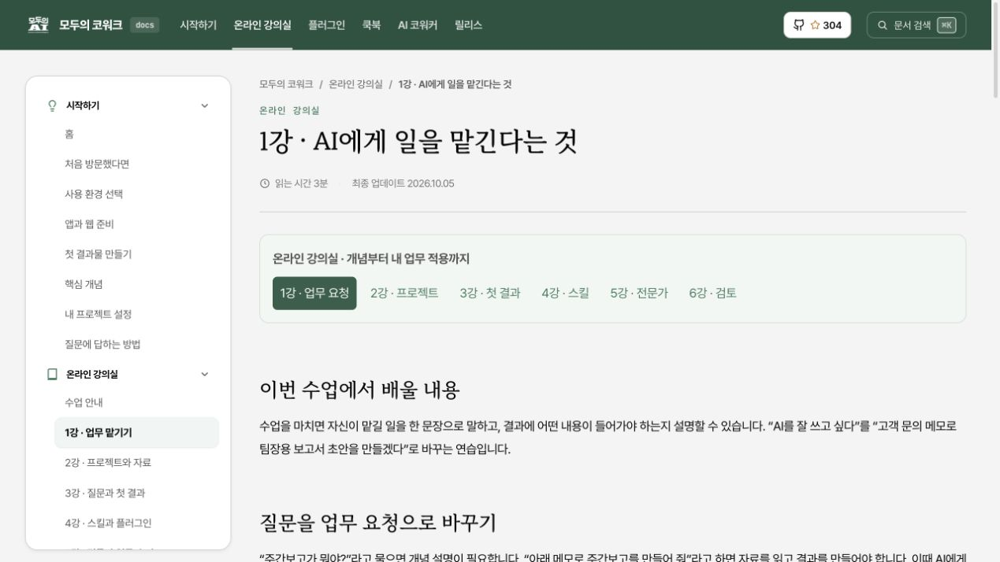
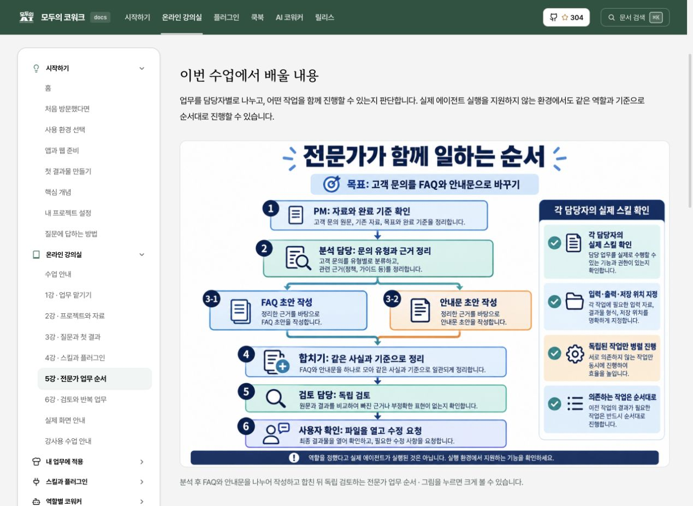

# MoAI-Cowork 온라인 문서·강의 자료 전면 개편 보고서

작성일: 2026년 10월 5일 · 대상: ChatGPT Work와 Claude Cowork를 사용하는 입문자와 강사

## 1. 완료한 내용 (Claim)

온라인 문서를 **업무 개념 이해 → 프로젝트와 자료 준비 → 질문과 첫 결과 → 스킬 선택 → 전문가 협업 → 검토와 반복 업무** 순서로 개편했다. 두 제품을 함께 설명하고, 입문 과정과 터미널·MCP 고급 설정을 분리했다. 로컬 소스와 빌드 결과에서 변경을 확인했으며 공개 사이트에 배포하지는 않았다.

| 항목 | 이번 작업에서 확인한 결과 |
|---|---|
| 문서 원본 | 148개에서 171개로 증가. 기존 119개 변경, 23개 추가, 삭제 0개 |
| 온라인 강의 | 6강, 수업 안내, 실제 화면 안내, 강사용 안내 |
| 추가 설명 | 업무 예제 42개와 역할 안내 17개에 가상 자료·예상 결과·오류 설명·확인 문제 추가 |
| 새 한국어 인포그래픽 | 4개. 개념, 첫 업무, 프로젝트와 폴더, 전문가 협업 |
| 제품 실제 캡처 | ChatGPT 웹 2개, Claude 웹 2개. 시작 화면과 플러그인 화면 |
| 문서 화면 검증 | 실제 로컬 브라우저에서 데스크톱·모바일 확인 및 캡처 |
| 기존 주소 보존 | 이전 로컬 빌드의 HTML 주소 264개 모두 새 빌드에 존재 |
| 최종 빌드 | HTML 288개, 내부 참조 25,098개, 앵커 참조 3,345개 검사. 오류 0개 |
| 검색·사이트맵 | 검색 항목 170개, 사이트맵 항목 192개. 각 목적지 존재 확인 |
| 스킬 참조 | 252개 스킬·18개 패키지의 오프라인 계약 검사 오류 0개 |

이 수치는 문서·빌드·정적 계약의 측정이다. 앱에서 모든 플러그인을 설치하고 업무를 실행한 결과나 수강생의 학습 효과를 뜻하지 않는다.

## 2. 조사 범위와 개선 근거

### 온라인 사이트와 원본

공개 사이트 `https://cowork.mo.ai.kr/`에서 내부 링크로 발견한 주소 201개를 읽기 전용으로 요청했다. HTTP 200 응답 153개, HTTP 404 응답 48개를 기록했으며 탐색 상한에 남은 주소는 없었다. 이는 발견한 주소의 조사 결과이며 인터넷 전체나 외부 사이트 전체를 조사했다는 의미가 아니다. 주소의 끝에 `/`가 없는 경우와 있는 경우도 별도 요청에 포함된다.

기록은 [온라인 조사 요약](online-summary-before.json), [응답 본문·링크·해시](online-pages-before.json), [404로 연결된 링크 위치](online-broken-links.json)에 보존했다. 404를 문서 48개가 삭제된 것으로 해석하면 안 된다. 일부는 상대 경로가 다른 위치로 해석된 주소다. 예를 들어 `/getting-started` 응답의 `first-task/` 링크는 `/first-task/`로 해석되었으며 이 주소의 404를 관측했다. 개편에서는 사이트 루트부터 시작하는 문서 링크를 사용하고 빌드에서 목적지를 검사했다.

원본 Markdown 148개의 경로·크기·해시를 개편 전에 저장했다. 이후 171개와 비교한 결과는 [원본 차이](source-diff.json)에 있다. 기존 쿡북 원문 52개는 이 보고서 폴더의 `original-lessons/`에 보관했다. 릴리스 기록 본문은 유지하고 잘못된 이동 경로를 고쳤다.

### 공식 문서 대조

제품 사용법은 OpenAI·Anthropic의 공식 안내를 우선 확인했다. 개발용 Codex·Claude Code의 기능을 일반 웹 작업에 그대로 적용하지 않고, 제품·계정·실행 위치를 구분했다.

| 주제 | 공식 자료 | 문서에 적용한 기준 |
|---|---|---|
| ChatGPT Work | [Work 시작](https://learn.chatgpt.com/docs/get-started-with-work) | 실제 Work 입력창과 업무 시작 흐름 |
| 프로젝트 | [ChatGPT Projects](https://learn.chatgpt.com/docs/projects) | 프로젝트 지침·자료와 컴퓨터 폴더 접근 구분 |
| 스킬·플러그인 | [스킬과 플러그인](https://learn.chatgpt.com/docs/skills-and-plugins), [플러그인](https://learn.chatgpt.com/docs/plugins) | 설치, 현재 작업에 노출, 실제 실행을 구분 |
| Claude Cowork | [Cowork 시작](https://support.claude.com/en/articles/13345190-get-started-with-claude-cowork) | 통합 입력창 전환, 실행 위치와 컴퓨터 연결 확인 |
| Claude 프로젝트 | [Claude 프로젝트](https://support.claude.com/en/articles/9519177-how-can-i-create-and-manage-projects), [Cowork 프로젝트](https://support.claude.com/en/articles/14116274-organize-your-tasks-with-projects-in-claude-cowork) | 기존 프로젝트 가져오기와 폴더 기반 프로젝트 구분 |
| Claude 플러그인 | [플러그인 사용](https://support.claude.com/en/articles/13837440-use-plugins-in-claude) | 실제 사용자 지정 메뉴와 설치 경로 확인 |
| 개발 환경 | [OpenAI 플러그인](https://developers.openai.com/plugins), [Claude Code 플러그인](https://code.claude.com/docs/en/plugins) | 고급 설정으로 분리하고 지원 범위 확인 |

공식 문서에도 점진 적용과 실행 위치 변경이 안내되어 있다. 특히 10월 5일 확인한 Cowork 안내에는 Pro·Max의 새 작업이 10월 6일부터 클라우드에서 실행되는 변경 공지가 있다. 수업 당일의 계정 화면을 확인하도록 사용 환경 안내에 반영했다. 특정 날짜의 공지를 모든 계정에서 이미 적용된 상태로 설명하지 않았다.

OpenAI Markdown 원본과 수집 주소는 이 폴더의 `work-official.md`, `projects-official.md`, `skills-official.md`, `plugins-official.md`, [출처 기록](openai-sources.json)에 있다. 학습자가 볼 공식 출처는 [사이트 자료 색인](../../www/content/help/source-index.md)에도 연결했다. 공식 자료를 대체하는 복제 문서보다 짧은 제품 설명과 MoAI의 실습·검토 기준을 중심으로 작성했다.

## 3. 개선 항목과 반영 결과

| 항목 | 관측·비교한 근거 | 반영한 내용 | 확인 방법 |
|---|---|---|---|
| 문서 이동 경로 | 공개 요청에서 48개 404, 저장된 원문 링크 | 상대 경로 수정, 메뉴·본문·릴리스 링크 정리 | 빌드 전체 내부 참조 검사 |
| 입문자 학습 경로 | 개편 전 148개 원본과 메뉴, 개편 후 새 강의 구조 | 6강의 단계별 설명, 강의실 진입점, 수업 이동 | 원본 목록과 실제 브라우저 |
| 두 제품의 사용 흐름 | 공식 문서와 실제 웹 화면 | Work와 Cowork를 나란히 설명, 통합 화면 안내 | 공식 출처 및 캡처 |
| 프로젝트와 로컬 폴더 | 공식 Projects 설명, 새 지침 예제 | 지침 생성·저장·참조·업무 실행을 분리 | 2강·프로젝트 설정의 내용 확인 |
| 질문 도구 | 사용자 제공 화면과 현재 질문 도구 | ChatGPT에서 질문 도구 사용 가능, 현재 환경에서 도구를 확인하고 필요한 맥락 요청 | 질문 안내·PM 계약의 기존 업데이트 연결 |
| 전문가 협업 | 저장소의 스킬 경로·PM 계약 | 스킬 후보, 역할별 입력·출력·시작 조건, 병렬 분기와 합치기, 독립 검토 | 스킬 계약 검사 및 5강 원문 |
| 예제의 이해도 | 원문과 추가 예제 비교 | 가상 자료, 예상 결과, 흔한 실수, 수정 요청, 해설, 내 업무 적용 | 추가한 59개 페이지 목록 |
| 이미지 설명 | 새 이미지 4개와 수업 본문 | 쉬운 한국어 개념도, 클릭 확대, 이미지 주요 내용의 본문 설명 | 원본 이미지와 실제 렌더링 |
| 실제 화면 안내 | 직접 접속한 두 웹 제품 | 실제 캡처 4개, 촬영일·환경·확인 범위 표시 | 사진과 화면 안내 페이지 |
| 코드 복사 | 브라우저에서 두 종류의 버튼 표시 관측 | 중복 버튼 숨김, 실패 시 직접 복사 안내 | 버튼 표시와 DOM 모형 4분기 확인 |
| 모바일 이동 | 390×844 브라우저 화면 | 짧은 수업 링크, 메뉴·검색, 화면 크기 변경 시 메뉴 상태 처리 | 실제 클릭·검색·폭 측정 |
| 과도한 검증 표시 | 메타데이터 기본 검토자 설정 읽기 | 명시하지 않은 사람의 검토 이름 제거 | 템플릿·빌드 확인 |
| 유지 관리 | 새 검사 스크립트와 CI 설정 | 내부 링크·앵커·이미지·검색·실습 검사, 문서 변경 CI | 로컬 검사와 YAML 구성 확인 |

독자 흐름과 설명 방식은 편집상의 개선이다. 수강생을 대상으로 이해도 향상 수치를 측정한 것은 아니므로 이를 검증된 학습 성과로 보고하지 않는다.

## 4. 강의와 문서 구조

강의의 각 단계는 배울 내용, 그림과 설명, 가상 예제, 실제 입력할 요청, 예상 결과, 흔한 실수, 확인 문제와 접힌 해설로 이어진다. 수업마다 6강 이동 링크를 제공하고 전체 강의·실습 자료·실제 화면으로 돌아갈 수 있게 했다.

| 수업 | 핵심 내용 | 실습 결과와 검토 기준 |
|---|---|---|
| 1강 · 업무 맡기기 | 프로젝트·지침·스킬·에이전트·플러그인·MCP, 업무 요청의 다섯 요소 | 목표·독자·자료·형식·완료 기준을 자신의 말로 작성 |
| 2강 · 프로젝트와 자료 | 오래 쓸 지침과 이번 작업의 원본, 웹 자료와 컴퓨터 폴더 | 실제 읽은 자료 이름과 문의 행 수 확인 |
| 3강 · 질문과 첫 결과 | 결과를 바꾸는 질문, 미정 항목, 보고서 초안 | 진행 중인 일과 완료된 일을 구분하고 메모와 표 비교 |
| 4강 · 스킬과 플러그인 | 필요한 기능 선택, 설치·노출·실행, 외부 연결 | 추천받은 스킬과 실제 사용한 기능을 구분 |
| 5강 · 전문가 업무 순서 | 역할별 입력·출력, 독립 작업, 의존 작업, 합치기 | 문의 6건을 FAQ와 안내문으로 나누고 정책으로 검토 |
| 6강 · 검토와 반복 업무 | 초안·검토·승인·실행, 정책 근거, 새 자료 | 출고와 배송 완료의 차이를 찾고 재사용할 기준 작성 |

문서의 큰 이동 순서는 시작하기, 온라인 강의실, 업무별 실습, 스킬과 플러그인, 역할별 코워커, 고급 설정, 도움말·릴리스다. 터미널 설치와 로컬 실행 구조는 고급 설정으로 분리했다. 쿡북은 업무에 맞는 예제를 찾는 용도로, 강의실은 처음부터 개념과 실행 순서를 배우는 용도로 구성했다.

[강사용 안내](../../www/content/learn/teaching-guide.md)에는 시연, 개인 실습, 결과 비교, 질문, 과제, 평가 기준을 넣었다. 앱이 다른 수강생도 같은 가상 자료와 완료 기준으로 비교할 수 있다. 실행이 막힌 경우에는 모범 결과로 검토 연습을 하고 미실행 상태를 기록한다.

실습 자료는 `www/static/downloads/classroom/`에 있다. 문의 CSV는 배송 3건·반품 2건·결제 1건의 6행이다. 정책에 없는 결제 원인을 만들지 않고 확인 필요 항목으로 남기도록 설계했다. 숫자 예제는 원문에서 값을 읽어 전체 완료율 68%, 지출 합계 25,000원, 가정에 따른 차액 700,000원 등을 비교했다. 차액을 실제 순이익으로 제시하지 않는다.

## 5. MoAI-Cowork 컨셉의 연결

MoAI-Cowork의 프로젝트 업무는 다음 순서로 설명했다.

1. **맥락 받기:** 목표, 독자, 원본, 결과 형식, 완료 기준, 외부 실행 범위를 확인한다. 부족한 조건은 질문 도구로 요청하고 답변 여부를 기록한다.
2. **실행 환경 확인:** 사용할 Projects, 자료 접근, 설치된 스킬과 에이전트 도구를 확인한다. 로컬 파일을 만들었다는 사실과 앱 지침에 저장된 상태를 구분한다.
3. **업무 구성:** 프로젝트에 필요한 스킬을 매핑하고 각 역할의 입력·출력·저장 위치·완료 조건을 지정한다. 후보 추천만으로 실제 사용했다고 보고하지 않는다.
4. **지침 적용:** 생성한 기준을 지원되는 프로젝트 지침 경로에 저장하고 새 작업에서 참조되는지 확인한다. 계정의 Projects 저장을 자동 완료했다고 가정하지 않는다.
5. **순차·병렬 진행:** 앞 작업의 결과가 필요한 일은 기다린다. 서로 독립된 작업은 지원되는 경우에만 병렬 실행하고 결과 파일과 책임을 분리한다.
6. **합치고 검토:** 같은 사실·정책·출처 기준으로 결과를 합친 뒤 원문과 비교한다. 누락 정보를 추측으로 채우지 않는다.
7. **완료 보고와 재사용:** 실제 수행, 보류, 미확인 항목을 구분한다. 반복 기준은 남기고 이번 작업의 숫자와 조건은 새 자료로 받는다.

프로젝트별 전문가 수준의 업무 방법은 이전에 업데이트한 PM의 전문가 계약·질문 규칙·호스트 기능 계약과 연결했다. 이전 코드 전수 조사·수정 결과는 [기능 감사 보고서](../20261005-work-cowork-audit/report.md)와 [수정 검증 보고서](../20261005-work-cowork-update/report.md)에 있다. 이 문서 개편에서 그 코드의 모든 런타임 검증을 다시 수행한 것으로 보고하지 않는다.

## 6. 이미지와 실제 화면

| 새 이미지 | 설명하는 개념 | 보관 위치 |
|---|---|---|
| 여섯 가지 핵심 개념 | 프로젝트부터 MCP까지 고객 문의 사례로 비교 | `www/static/infographics/project-concepts-ko.png` |
| 첫 업무 흐름 | 목표, 자료, 질문, 검토 | `www/static/infographics/first-workflow-ko.png` |
| 프로젝트와 로컬 폴더 | 업무 기준과 실제 원본 위치, 접근 확인 | `www/static/infographics/project-context-ko.png` |
| 전문가 협업 흐름 | 분석 후 분기, 합치기, 검토, 사용자 확인 | `www/static/infographics/expert-workflow-ko.png` |

인포그래픽은 이미지 생성 도구로 제작한 개념 설명 그림이다. 실제 앱 화면으로 표현하지 않았다. 생성 프롬프트는 [이미지 제작 기록](image-prompts.json)에 보관했다. 주요 한글과 화살표·역할 관계를 눈으로 확인했고, 본문에도 같은 개념을 풀어 설명했다.

제품 캡처는 웹사이트를 직접 열고 메뉴를 조작한 실제 화면이다. ChatGPT Work 시작, Claude Cowork 시작, ChatGPT 플러그인 탐색, Claude 플러그인 탐색·추가 메뉴의 4개다. 개인 대화·진행 중 작업·프로필이 있는 영역은 접거나 캡처 범위에서 제외했다. 이미지 경로와 각 사진의 해석은 [실제 화면 안내](../../www/content/learn/screens.md)에 있다. 설치 완료나 모델 업무 실행의 증거로 사용하지 않는다.

개편한 문서를 실제 구동한 데스크톱 화면:

한국어 흐름도와 설명을 함께 보여 주는 5강 화면:

모바일에서는 메뉴·검색·수업 이동을 확인했다. [모바일 캡처](screenshots/lesson-mobile.jpg)와 [브라우저 관측 기록](browser-evidence.json)을 함께 보관했다. 새 사진과 그림의 크기·해시는 [자산 목록](asset-manifest.json)에 있다.

## 7. 검증과 기준선 (Evidence / Baseline-attribution)

측정 작업 트리: `/Users/goos/.codex/worktrees/b0aa/moai-cowork`

Git HEAD: `2c3cef1d24e88b3bfe8db61c713ffae317b346d0` · 분리된 작업 트리의 미커밋 변경 포함

세션: `01a10aae-6716-7681-b5d7-d558155d9f86` · Hugo `v0.160.1+extended+withdeploy darwin/arm64`

빌드 경로: `/tmp/moai-docs-20261005-final`. 이전 HTML 주소 비교 대상은 이번 작업에서 보존한 로컬 빌드 `/var/folders/kt/nq2q81cn4gx3y41r7x47ggmr0000gn/T/moai-cowork-hugo-final-opr_651y`다. 공개 사이트의 서버 파일 목록과 같은 것으로 간주하지 않는다.

| 실행한 확인 | 관측 결과 | 증거 |
|---|---|---|
| Hugo 최종 빌드 | 종료 0, 출력 없음 | [명령·출력 기록](verification.md) |
| 전체 로컬 참조 | HTML 288개, 참조 25,098개, 앵커 3,345개, 이미지 참조 413개, 오류 0개 | [검사 JSON](site-check.json) |
| 검색·사이트맵 | 각각 170·192 항목, 목적지 존재 | 동일 검사 JSON |
| 원본·주소 보존 | 원본 삭제 0, 기존 HTML 주소 누락 0 | [원본 차이](source-diff.json), [주소 비교](legacy-url-check.json) |
| 가상 실습 | CSV 6행과 유형별 건수, 11개 문서의 수치 예제 일치 | 동일 검사 JSON |
| 검사기의 오류 탐지 | 격리 사본의 깨진 링크와 26,000원으로 바꾼 오답 모두 탐지 | [의도적 오류 검사](checker-negative.json) |
| 코드 복사 표시 | 성공·거절·대체 성공·대체 거절의 4분기에서 맞는 표시, `$` 제거 | [DOM 모형 검사](copy-logic-check.json) |
| 스킬 계약 | 252개·18개, 오류 0개, 오프라인 검사 | [스킬 검사](skill-check.json) |
| CI 파일 | YAML 구문·읽기 권한·4단계·실행 상한 확인 | [CI 구성 검사](ci-config-check.json) |
| 변경 서식 | `git diff --check` 종료 0 | 명령·출력 기록 |
| 실제 문서 UI | 모바일 메뉴와 2강 이동, 검색·Esc 후 초점 복귀, 답안 펼치기. 문서 전체 폭 초과 없음 | 브라우저 기록과 캡처 |

이미지 참조 413개는 413개의 서로 다른 새 이미지가 아니다. 같은 이미지가 여러 페이지에 쓰인 횟수를 포함한다. 검색·사이트맵·HTML 수에도 콘텐츠 외 분류·별칭 페이지가 포함되므로 원본 171개와 같은 단위로 비교하지 않는다.

검사기의 오류 탐지 확인 중 macOS의 `/var`와 `/private/var` 경로 차이로 예외를 관측했다. 검사 진입점에서 기준 경로를 정규화한 뒤 격리 사본 검사를 다시 실행해 두 오류 탐지가 통과함을 확인했다. 성공 결과만 감지하는 검사가 되지 않도록 오답을 넣는 확인을 추가했다.

## 8. 아직 관측하지 않은 범위 (Gaps)

- 공개 사이트 배포와 배포 후 링크·검색·이미지 확인은 수행하지 않았다. 공개 사이트의 기존 404가 해결되었다고 주장하지 않는다.
- ChatGPT 데스크톱 앱은 촬영 도구의 접근 제한으로 촬영하지 못했다. Claude 데스크톱에서도 게시 가능한 안전한 캡처를 확보하지 못했다. 실제 제품 사진 4개는 웹 화면이다.
- 두 제품 UI에서 MoAI 설치, 외부 서비스 인증, 예제 모델 실행, Projects 지침 저장과 새 작업의 적용까지 수행하지 않았다. 원격 연결과 전문가 에이전트의 실제 병렬 실행도 이번 문서 작업의 통과 주장에 포함되지 않는다.
- 브라우저에서 복사 버튼을 눌렀지만 클립보드 읽기 결과로 복사 성공을 입증하지 못했다. DOM 모형 검사와 실제 운영체제 클립보드 검증은 별개다.
- CI 구성은 로컬에서 검사했으며 GitHub Actions 원격 실행은 하지 않았다.
- 외부 출처 링크의 모든 시점·계정별 이용 가능 여부, 모바일 기기 실물, 스크린리더 음성 읽기, 수강생 학습 효과는 측정하지 않았다.

## 9. 남는 위험과 유지 관리 (Residual-risk)

제품 화면과 지원 범위는 계정·조직·점진 적용에 따라 달라진다. 캡처는 2026년 10월 5일의 화면이며 수업 당일의 상태와 비교해야 한다. 로컬 연결이 필요한 실습은 앱 연결과 원본 읽기를 먼저 확인한다.

최종 공개 단계에서는 이 작업 트리의 변경을 검토하고 배포한 뒤 공개 주소에서 강의실·첫 실습·검색·이미지·다운로드를 확인해야 한다. 배포 전 로컬 검사를 배포 성공으로 보고하지 않는다. 제품 UI에서의 작은 실습 실행과 수강생 관찰은 다음 검증 단계이며, 검증 전에는 예상 결과와 실제 결과를 구분하는 현재 표시를 유지한다.

문서 수정 시 `hugo` 빌드와 `scripts/check-docs.py`를 실행하면 링크·앵커·이미지·검색·예제의 확인을 반복할 수 있다. 이 폴더의 개편 보조 스크립트는 작업 당시 원본을 변환한 기록이며 재실행하면 이후 편집을 덮어쓸 수 있으므로 운영 명령으로 사용하지 않는다.
