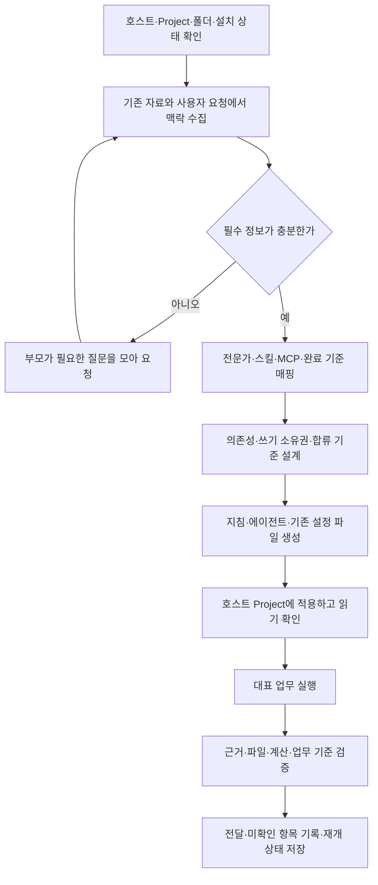

# MoAI-Cowork: ChatGPT Work·Claude Cowork 전수 조사 및 개선 보고서

작성일: 2026-10-05 · 조사자: 영실이 · 원본 코드 수정: 없음

## 1. 종합 판단

**MoAI-Cowork에는 18개 플러그인, 252개 업무 스킬, 28개 전문가 에이전트, 6개 자체 MCP 서버가 이미 갖춰져 있다. 다음 개선의 중심은 프로젝트 설정을 실제 호스트에 적용하고, 그 프로젝트의 맥락·전문가·워크플로우가 다음 업무에서도 이어지는지 검증하는 것이다.**

현재 로컬 코드 검사와 테스트는 상당 부분 통과했다. 그러나 이 결과만으로 ChatGPT Work와 Claude Cowork의 Projects에서 프로젝트 설정부터 실제 업무 완료까지 동일하게 작동한다고 판정할 수는 없다. 이번 조사에서 공통 스킬 형식 위반, 프로젝트 맥락 저장 지시 충돌, 오래된 스킬 소속 매핑, 순차 실행만 규정한 PM 워크플로우, MCP 도구 권한 메타데이터 누락을 확인했다.

가장 먼저 처리할 사항은 다음과 같다.

| 우선순위 | 개선 사항 | 이번 조사에서 확인한 근거 |
|---|---|---|
| High | 공통 스킬 메타데이터 정규화 | `skills-ref` 0.1.1: 252개 중 252개 실패. 전부 최상위 `version`; 10개는 `user-invocable`도 포함 |
| High | Projects 적용·읽기 확인 | PM 생성 절차는 파일 생성을 규정하지만 호스트 Project UI 지침 적용·새 대화 읽기 확인을 완료 조건으로 다루지 않음 |
| High | 인터뷰 결과 영속화 | 맥락 요약을 저장한다는 지시와 `.moai/context.md`를 빈 파일로 만든다는 지시가 충돌 |
| High | 실제 설치 상태에 따른 스킬 매핑 | PM 참고 패턴·설정 예제가 현재 플러그인별 스킬 소속과 다름 |
| High | 순차·병렬 워크플로우 계약 | PM 실행 루프·템플릿은 순차 체인을 규정. 의존성·쓰기 소유권·병렬 합류 기준이 없음 |
| High | MCP 동작·권한 메타데이터 | 6개 서버를 실제 import해 조회한 도구 154개 모두 `annotations: null` |
| High | 호스트별 질문 계약 통합 | 한 질문 공통 단위, 슬롯 채우기, 여러 질문 묶기 지시가 동시에 존재 |
| High | 실제 업무 평가와 호스트 실행 증거 | 469개 로컬 테스트 통과와 32개 스킬 시나리오 파일은 확인. 실제 Work·Cowork 업무 평가는 미실행 |

위 우선순위는 현재 확인된 영향과 사용자가 제시한 제품 목표에 따른 개발 순서다. 실제로 사용자 데이터가 유실되었거나 승인 없이 외부 작업이 실행되었다고 주장하는 보안 사고 판정은 아니다.

## 2. 조사 범위와 판정 기준

### Baseline-attribution — 이번에 조사한 기준선

| 항목 | 값 |
|---|---|
| 작업 트리 | `/Users/goos/.codex/worktrees/b0aa/moai-cowork` |
| HEAD | `2c3cef1d24e88b3bfe8db61c713ffae317b346d0` |
| Git 상태 | 조사 시작 시 변경 없음, detached HEAD. 보고서·증거 파일만 추가 |
| 추적 파일 | 1,796개, 41,571,347바이트 |
| 텍스트 / 바이너리 | 1,576개 / 220개 |
| 업무 스킬 / 저장소 전체 스킬 | 252개 / 269개. 나머지 17개는 개발용 `.agents/skills` 래퍼 |
| 플러그인 에이전트 | 28개 |
| 자체 MCP 서버 / 런타임 등록 도구 | 6개 / 154개 |

모든 추적 파일을 바이트 단위로 읽고 SHA-256·크기·텍스트 여부를 기록했다. 모든 텍스트를 구조·참조 검사 대상으로 삼고, PM·호스트 배선·에이전트·워크플로우·MCP·런처·자격증명·CI·현재 사용자 문서를 심층 검토했다. Python·JSON·TOML·YAML과 Shell·JavaScript의 구문을 기계적으로 검사했다. 바이너리 자산은 해시·존재 확인 범위이며, 220개 이미지·폰트 등의 시각 품질을 전부 사람이 검수한 것은 아니다.

**전수 구조·구문·참조 검사와 핵심 실행 경로 심층 검토를 완료했다. 252개 스킬의 모든 업무 산출물을 실제 모델로 생성해 전문가 정확도까지 평가한 조사는 아니다.** 전체 경로 목록과 스킬·에이전트별 메타데이터는 다음 증거에서 확인할 수 있다.

- [전체 파일 인벤토리](/Users/goos/.codex/worktrees/b0aa/moai-cowork/reports/20261005-work-cowork-audit/inventory.json)
- [269개 스킬·28개 에이전트 조사표](/Users/goos/.codex/worktrees/b0aa/moai-cowork/reports/20261005-work-cowork-audit/skills-agents.json)
- [18개 플러그인 매니페스트·MCP 배선](/Users/goos/.codex/worktrees/b0aa/moai-cowork/reports/20261005-work-cowork-audit/plugins.json)
- [구조·참조 검사 결과](/Users/goos/.codex/worktrees/b0aa/moai-cowork/reports/20261005-work-cowork-audit/scan-results.json)

판정은 세 가지로 나눴다. **확인**은 코드·파일·도구 출력에서 관찰한 사실, **설계 보완**은 확인된 현재 구조와 제품 목표 사이의 차이, **미실행**은 실제 호스트·계정·외부 서비스에서 실행해야 결론을 낼 수 있는 항목이다. 텍스트 패턴만으로 발견한 후보는 그대로 결함 수에 넣지 않았다.

## 3. 공식 문서에 따른 호스트 구분

### 3.1 Projects와 로컬 작업 폴더

ChatGPT의 계정 Project는 업로드·연결된 소스와 프로젝트 지침을 공유한다. 로컬 Project는 컴퓨터 폴더에 접근하는 별도 경로다. 연결된 컴퓨터를 이용하는 Work 실행도 접근 범위와 실제 실행 위치를 확인해야 한다. 따라서 Project 이름과 폴더 경로가 같다는 이유만으로 동일한 맥락이 자동 공유된다고 처리해서는 안 된다. [OpenAI Projects 공식 문서](https://learn.chatgpt.com/docs/projects)

Claude의 현재 Projects 문서는 파일·맥락·지침·메모리를 프로젝트에 묶으며, 기존 컴퓨터 폴더로 만든 프로젝트와 계정에 저장되는 프로젝트를 구분한다. 앱 경험도 점진적으로 바뀌고 있으므로 설정 안내는 현재 화면과 기능을 확인한 뒤 제공해야 한다. [Claude Projects 공식 문서](https://support.claude.com/en/articles/14116274-organize-your-tasks-with-projects-in-claude-cowork)

| 실행 환경 | MoAI-Cowork 설정에서 확인할 사항 | 생성·적용 방식 |
|---|---|---|
| ChatGPT Work, 계정 Project | 업로드·연결 소스, 로컬 폴더 접근 유무, 설치 스킬·커넥터 | Project 지침용 본문과 소스 묶음을 제공하고 적용 상태 확인 |
| ChatGPT/Codex 데스크톱, 로컬 Project | 실제 작업 루트, 지침 발견 경로, 도구·에이전트 사용 가능 상태 | `AGENTS.md`와 지원되는 로컬 에이전트 설정 생성 후 새 실행에서 확인 |
| Work에서 연결된 컴퓨터 사용 | 부모·하위 작업의 실행 위치, 폴더 접근, 도구·정책 차이 | 사용할 파일과 연결을 명시하고 호스트별 실행 가능 단계를 확인 |
| Claude, 계정 Project | 프로젝트 지침·첨부 소스·설치된 계정 스킬 | Project UI에 넣을 지침과 첨부 자료를 제공하고 읽기 확인 |
| Claude, 로컬 폴더 기반 Project | 폴더 연결·Project 지침·플러그인 노출 | 폴더 파일 생성과 UI 지침 적용을 각각 검증 |
| Claude Code | 버전·지침 설정·플러그인 에이전트·MCP | `CLAUDE.md` 포인터 또는 지원되는 `AGENTS.md` 직접 읽기 경로 검증 |

이 표는 권장 설정 분기다. 이 조사에서 각 앱에 설치·실행한 인증 결과표는 아니다.

### 3.2 지침 파일·스킬·에이전트는 서로 다른 기능이다

Codex의 `AGENTS.md`는 실행 시작 시 발견 경로를 따라 읽는다. 기본 프로젝트 지침 예산은 파일 개수가 아니라 합계 32 KiB 바이트다. 파일을 쓴 뒤 새 실행에서 어떤 지침이 읽혔는지 확인해야 한다. [OpenAI AGENTS.md 공식 문서](https://learn.chatgpt.com/docs/agent-configuration/agents-md)

현재 Claude Code는 버전·설정에 따라 `AGENTS.md`를 직접 읽을 수 있고, `CLAUDE.md`의 `@AGENTS.md`도 호환 경로로 유지된다. 따라서 기존 포인터를 없애는 일보다 호스트에서 실제 읽힌 경로를 확인하는 일이 우선이다. 이 Code 동작을 모든 Cowork Project UI 동작으로 확장해 단정하지 않는다. [Claude Code 메모리 공식 문서](https://code.claude.com/docs/en/memory)

ChatGPT Work의 하위 에이전트 기능과 로컬 Codex의 커스텀 에이전트 설정은 별개다. 로컬 `.codex/agents/*.toml`은 `name`, `description`, `developer_instructions`를 갖는 현재 공식 형식이다. Work에는 지원 계정에서 호스팅된 하위 에이전트 작업 흐름이 제공되지만 로컬 TOML 발견까지 자동 보장되는 것은 아니다. [OpenAI Subagents 공식 문서](https://learn.chatgpt.com/docs/agent-configuration/subagents)

Claude Code 에이전트의 `skills`는 선택적인 사전 로드 기능이다. 현재 worker가 `Skill`로 필요한 스킬을 동적으로 읽는 방식도 유효하다. 모든 전문가에게 모든 스킬 본문을 미리 넣을 필요는 없다. [Claude Subagents 공식 문서](https://code.claude.com/docs/en/sub-agents)

### 3.3 플러그인 포맷과 배포 경로

OpenAI는 루트 `plugin.json`·`mcp.json` 공통 포맷을 권장하며 기존 `.codex-plugin/plugin.json`을 호환 경로로 지원한다. 현재 매니페스트 디렉터리 때문에 플러그인이 곧바로 무효인 것은 아니다. 공통 포맷으로 옮길 때 전송 타입과 OpenAI 확장 설정의 우선순위를 검증해야 한다. [OpenAI 패키징 공식 문서](https://developers.openai.com/plugins/build/plugins)

Claude 명령·에이전트에 담긴 재사용 업무는 OpenAI에서 스킬로 옮기는 것이 공식 이전 방향이다. OpenAI에서는 Claude `userConfig`의 입력·치환을 동일하게 제공한다고 가정할 수 없고, 공개 배포용 MCP와 로컬 팀 배포용 MCP의 요구 조건도 다르다. [OpenAI Claude 플러그인 이전 공식 문서](https://developers.openai.com/plugins/guides/submit-claude-plugin)

플러그인 훅은 cloud-orchestrated ChatGPT Work에서 지원되지 않으며, Synced Work의 관리자 MCP 훅도 별도 조건을 따른다. 핵심 업무 검증을 훅만으로 강제하는 설계를 추가해서는 안 된다. [OpenAI 플러그인 공식 문서](https://learn.chatgpt.com/docs/plugins)

## 4. 확인된 개선 항목

### F01 · High · 공통 스킬 형식 위반

**Claim.** 252개 스킬 모두 최상위 `version`을 쓰고, 그중 10개는 `user-invocable`도 쓴다. 공식 문서가 안내하는 `skills-ref` 0.1.1의 실제 검증에서 전부 실패했다. `korean-humanize`의 설명은 1,483자로 공통 규격 상한 1,024자도 초과한다.

**Evidence.** `uv run --no-project --python 3.11 --with skills-ref==0.1.1 python reports/20261005-work-cowork-audit/validate_skills.py`에서 각 스킬 디렉터리에 `skills_ref.validate()`를 실행했다(exit 1). 출력은 `checked: 252`, `passed: 0`, `failed: 252`; 메타데이터 오류 252건과 설명 길이 오류 1건이다. [전체 스킬별 검증 결과](/Users/goos/.codex/worktrees/b0aa/moai-cowork/reports/20261005-work-cowork-audit/skills-ref-validation.json)

**개선.** 공통 스킬의 버전은 `metadata.version` 문자열로 이동한다. 호스트 전용 호출 설정은 지원되는 배포 경로에서만 사용한다. `korean-humanize` 설명은 용도·진입 조건으로 줄이고 변경 이력·세부 기법은 본문 또는 참조 문서로 옮긴다. [Agent Skills 공식 규격](https://agentskills.io/specification), [Claude의 배포 경로별 frontmatter 규칙](https://code.claude.com/docs/en/skills)

**Gaps / Residual-risk.** Claude Code 플러그인 경로에서의 관대한 읽기와 계정 스킬 업로드 검증은 다르다. 이번 결과는 공통 규격 위반을 입증하며, 18개 플러그인 설치가 모든 앱에서 실패했다는 재현 결과는 아니다. 필드 이동 시 버전 파서·문서 생성 도구도 함께 검증해야 한다.

### F02 · High · 폴더 지침 생성과 Projects 적용을 한 단계로 취급

**Claim.** PM은 `AGENTS.md`와 `CLAUDE.md`를 생성하면 공통 지침이 읽힌다는 설명을 중심으로 구성돼 있다. Project UI 지침·소스 연결·새 대화에서의 읽기 확인을 분기별 완료 조건으로 두지 않는다.

**Evidence.** [generator의 자동 읽기 설명](/Users/goos/.codex/worktrees/b0aa/moai-cowork/plugins/moai-pm/skills/project/references/agentsmd-generator.md:5), [PM Desktop Parity](/Users/goos/.codex/worktrees/b0aa/moai-cowork/plugins/moai-pm/skills/project/SKILL.md:254), [초기화 Phase 6–8](/Users/goos/.codex/worktrees/b0aa/moai-cowork/plugins/moai-pm/skills/project/references/init-protocol.md:251)을 대조했다.

**개선.** 시작 시 실행 환경·Project 종류·폴더 접근·지침 로더·커스텀 에이전트 지원을 확인한다. 파일 생성 다음에 호스트 적용, 읽기 확인, 대표 업무 실행을 넣는다. UI를 직접 수정할 도구가 없으면 바로 붙여 넣을 수 있는 지침과 구체적인 적용 절차를 제공한다. 적용을 관찰하지 못했으면 `파일 생성 완료 / Project 적용 미확인`으로 구분한다. 근거는 §3.1–3.2 공식 문서다.

**Gaps / Residual-risk.** Cowork가 특정 폴더 지침을 절대 읽지 않는다고 판정하지 않는다. 현재 절차에 모든 배포 경로의 적용 보장이 없다는 설계 공백이다.

### F03 · High · 맥락 요약 저장 지시와 빈 파일 생성 지시 충돌

**Claim.** 인터뷰·재개 절차는 `.moai/context.md`를 읽고 요약을 보존하라고 하지만 generator는 같은 파일을 빈 파일로 만들라고 지시한다.

**Evidence.** [generator 7단계](/Users/goos/.codex/worktrees/b0aa/moai-cowork/plugins/moai-pm/skills/project/references/agentsmd-generator.md:176), [재개 규칙](/Users/goos/.codex/worktrees/b0aa/moai-cowork/plugins/moai-pm/skills/project/SKILL.md:148), [생성 대상](/Users/goos/.codex/worktrees/b0aa/moai-cowork/plugins/moai-pm/skills/project/SKILL.md:204). `coverage` 상태와 사용자가 준 실제 답은 같은 데이터가 아니다. 설치 대기용 `init-progress.json`의 답 저장은 이미 존재하지만 일반 초기화 완료 시 빈 맥락 파일 지시와의 충돌을 해결하지 않는다.

**개선.** `.moai/context.md`에 확정된 프로젝트 목적·산출물·독자·사실·금지 사항·출처·유예 질문을 저장한다. 기존 `config.json`에는 구조화된 값·상태·근거 참조를 두고 두 파일의 역할을 명확히 한다. 빈 파일 지시는 제거하며, 초기화 뒤 새 대화에서 이미 받은 답을 재질문하지 않는지 확인한다.

**Gaps / Residual-risk.** 실제 사용자 답이 소실된 런타임 재현은 미실행이다. 확인된 것은 상충하는 실행 지시다.

### F04 · High · PM 단독 패키지 밖의 로스터에 필수 의존

**Claim.** PM은 `.claude-plugin/marketplace.json`을 배포 로스터 정본으로 읽도록 요구한다. PM 플러그인 자체에는 그 파일이 없다.

**Evidence.** [PM 인벤토리 규칙](/Users/goos/.codex/worktrees/b0aa/moai-cowork/plugins/moai-pm/skills/project/SKILL.md:172), [업데이트 인벤토리](/Users/goos/.codex/worktrees/b0aa/moai-cowork/plugins/moai-pm/skills/project/references/update-protocol.md:13). `plugins/moai-pm`만 새 임시 디렉터리에 복사한 검사에서 `plugin_files: 19`, `required_roster_path_exists: false`, `plugin_manifest_exists: true`를 관찰했다. [패키지 경계 검사](/Users/goos/.codex/worktrees/b0aa/moai-cowork/reports/20261005-work-cowork-audit/pm-standalone-package-check.json)

**개선.** 현재 세션에 노출된 스킬·플러그인 목록을 우선한다. 접근 가능한 marketplace가 있으면 추천 목록으로 대조한다. 외부 로스터가 없을 때 사용할 최소 카탈로그 스냅샷을 PM 내부 참조 파일로 제공하거나, 설치된 스킬만으로 진행하는 경로를 정의한다. 추천 가능·설치됨·호출됨을 별개로 저장한다.

**Gaps / Residual-risk.** 실제 앱이 설치 캐시의 marketplace를 어느 경로로 제공하는지는 미실행이다. 사용자 작업 폴더에서 저장소 루트 파일이 항상 보인다고 가정할 수 없다는 패키지 경계 문제다.

### F05 · High · 현재 스킬 소속과 다른 라우팅 예제

**Claim.** `content-blog`를 `moai-coworker` 소속으로 기록하는 설정 예제와 여러 전문 스킬군을 `moai-coworker`에 모으는 참고 패턴은 현재 인벤토리와 다르다. `business-*`, `office-*`, `cd-*`도 현행 도메인 이름과 섞여 있다.

**Evidence.** [설정 예제](/Users/goos/.codex/worktrees/b0aa/moai-cowork/plugins/moai-pm/skills/project/references/init-protocol.md:110), [역할 배치](/Users/goos/.codex/worktrees/b0aa/moai-cowork/plugins/moai-pm/skills/project/references/init-protocol.md:128), [스킬 소속 참고 패턴](/Users/goos/.codex/worktrees/b0aa/moai-cowork/plugins/moai-pm/skills/project/references/init-protocol.md:182). 현재 `content-blog`는 `moai-marketer`, `finance-*`는 `moai-accountant`, `legal-*`는 `moai-lawyer` 등의 실제 디렉터리에 있다.

**개선.** 이름 접두어 추정 대신 `plugin:skill`, 버전·본문 digest·입력·출력·필요 MCP로 후보를 고른다. 예제도 현재 실제 ID로 자동 검증한다. 설명을 읽고 프로젝트 목적과 출력 계약에 맞춰 선택한 이유를 남긴다. 24개 고정 축 예시도 현재 프로젝트별 축 도출 규칙과 일치시킨다.

**Gaps / Residual-risk.** 모델이 다른 지시를 우선해 올바른 인벤토리를 사용할 가능성은 있다. 실제 오호출 재현을 주장하지 않는다.

### F06 · High · 순차·병렬을 지원하는 실행 계약 부족

**Claim.** PM의 생성 에이전트 루프와 기본 워크플로우는 체인 순차 실행을 규정한다. PM 파일에서 의존성, 동시 쓰기 충돌, 병렬 작업 합류와 재개 상태를 정의하지 않는다.

**Evidence.** [PM 실행 루프](/Users/goos/.codex/worktrees/b0aa/moai-cowork/plugins/moai-pm/skills/project/SKILL.md:190), [execution-protocol](/Users/goos/.codex/worktrees/b0aa/moai-cowork/plugins/moai-pm/skills/project/references/execution-protocol.md), [생성 템플릿](/Users/goos/.codex/worktrees/b0aa/moai-cowork/plugins/moai-pm/skills/project/references/templates/AGENTS.md.tmpl). PM 전체 파일에서 병렬·`depends_on`·`write_set`·`max_concurrent` 정의를 검색하고 본문을 대조했다.

**개선.** 기존 `config.json`의 워크플로우에 단계 ID·선행 단계·입출력·실행 주체·쓰기 경로·완료 기준을 추가한다. 독립된 조사·분석은 병렬, 같은 파일 편집과 외부 상태 변경은 소유권·순서를 정한다. 병렬 결과를 모으는 단계를 명시한다. 호스트·사용자 지침이 분업을 허용할 때만 하위 에이전트를 호출하며, 도구가 없으면 동일 계약을 순차 실행한다.

**Gaps / Residual-risk.** 다른 도메인 스킬이나 호스트 자체가 병렬 기능을 전혀 제공하지 않는다는 판정이 아니다. 프로젝트가 생성하는 실행 계약이 사용자의 요구를 아직 표현하지 못한다.

### F07 · High · 자체 MCP 도구 154개의 권한 메타데이터 누락

**Claim.** 6개 서버의 실제 등록 결과에서 154개 도구 모두 `annotations`가 `null`이다. 정적 AST가 센 134개보다 많은 것은 Cafe24의 동적 등록 20개 때문이다.

**Evidence.** `python3 reports/20261005-work-cowork-audit/probe_runtime.py` → `{"registered_tools": 154, "without_annotations": 154, "servers": 6}`. 이 명령은 서버 import와 `mcp.list_tools()`만 실행했다. [호출 명령·HEAD·출력 증거](/Users/goos/.codex/worktrees/b0aa/moai-cowork/reports/20261005-work-cowork-audit/runtime-probe-evidence.json)

**개선.** 실제 동작별로 `readOnlyHint`, `destructiveHint`, `openWorldHint`, 해당되는 `idempotentHint`를 정확히 선언한다. Imweb·Cafe24의 조회·수정 혼합 카테고리 도구는 전체를 읽기 전용으로 표시할 수 없다. 필요한 범위에서 조회·변경 도구를 나누거나 보수적인 도구 메타데이터와 action별 서버 검증을 함께 사용한다. 설명상의 승인 규칙과 실제 서버 인증·계정 범위·행위 검증을 모두 유지한다. [OpenAI MCP 심사 문서](https://developers.openai.com/plugins/deploy/app-review)

**Gaps / Residual-risk.** 이 메타데이터는 인증 자체를 대체하지 않는다. 누락이 곧 무단 거래 실행의 증거는 아니다. 원격 공개 배포 여부와 무관하게 도구 선택·동작 분류의 개선 근거가 된다.

### F08 · High · 질문 정책의 충돌과 도구별 구분 부족

**Claim.** PM에는 매 라운드 슬롯을 채우라는 지시, 공통 1질문×3옵션 지시, 질문 하나당 호출하지 말라는 지시가 함께 있다. 동적 8렌즈와 예전 24축 상태 예시도 섞여 있다.

**Evidence.** [슬롯 채우기](/Users/goos/.codex/worktrees/b0aa/moai-cowork/plugins/moai-pm/skills/project/SKILL.md:44), [공통 질문 단위](/Users/goos/.codex/worktrees/b0aa/moai-cowork/plugins/moai-pm/skills/project/SKILL.md:96), [분할 금지](/Users/goos/.codex/worktrees/b0aa/moai-cowork/plugins/moai-pm/skills/project/references/init-protocol.md:306), [24축 예제](/Users/goos/.codex/worktrees/b0aa/moai-cowork/plugins/moai-pm/skills/project/references/init-protocol.md:103). 현재 세션의 `request_user_input_async`는 자유 입력 질문도 지원하므로 `request_user_input`의 옵션 제약을 두 도구에 공통 적용해서는 안 된다.

**개선.** 질문 수는 미확인 필수 정보와 실제 도구 스키마로 결정한다. 선택형과 자유 서술형을 구분하고, 파일이 필요한 질문은 지원 채널을 따른다. 이미 받은 정보는 재사용한다. 질문 상태를 `대기/답변됨/유예/해당 없음`으로 기록한다. 무응답·미리 선택된 옵션을 답변으로 취급하지 않는 기존 규칙은 보존한다. 하위 작업의 누락 정보는 부모가 모아서 묻는다.

**Gaps / Residual-risk.** 도구가 없는 환경의 채널 정책은 호스트 상위 지침을 따른다. 특정 과거 UI 버그 설명을 현재 모든 호스트의 동작으로 일반화하지 않는다. 질문 충돌이 실제로 몇 회 추가 질문을 발생시켰는지는 미측정이다.

### F09 · High · 구조 검사와 실제 업무 평가 사이의 공백

**Claim.** 현재 wiring 검사는 frontmatter의 `name`·`description` 존재를 정규식으로 확인하며 공통 규격의 필드·길이까지 검증하지 않는다. MCP CI 경로 필터에는 일반 PM·업무 스킬 변경이 포함되지 않는다. 32개 `test-cases.yaml`은 기대 동작을 정의하지만 이번 조사에서는 모델 평가로 실행하지 않았다.

**Evidence.** [현재 frontmatter 검사](/Users/goos/.codex/worktrees/b0aa/moai-cowork/scripts/check-plugin-runtimes.py:124), [CI 경로 필터](/Users/goos/.codex/worktrees/b0aa/moai-cowork/.github/workflows/mcp-cross-platform.yml:5), [업무 평가 사례](/Users/goos/.codex/worktrees/b0aa/moai-cowork/plugins/moai-coworker/skills/collab-proposal/tests/test-cases.yaml:1). `.github/workflows`의 세 파일과 저장소 `scripts`에서 해당 사례를 실행하는 평가 배선을 확인하지 못했다. 이 범위 밖의 수동·외부 평가 존재는 미확인이다.

**개선.** 변경 스킬에 대한 표준 validator·참조 검사를 CI에 넣는다. PM 생성/재개/누락 입력/호스트 차이와 전문 산출물을 실제 모델·호스트로 평가한다. 기존 32개 사례를 출발점으로 사용하되, 문자열 포함 검사만으로 사실성·산술·의미 보존을 통과시키지 않는다. [OpenAI 스킬 설계·테스트 공식 문서](https://developers.openai.com/plugins/build/skills)

**Gaps / Residual-risk.** 32개 파일 수를 전체 행동 테스트 커버리지 비율로 계산하지 않는다. 로컬 테스트 통과와 전문가 산출물 정확도는 서로 다른 관측이다.

### F10 · Medium · 설치·에이전트 안내가 최신 기능 구분을 반영하지 못함

**Claim.** README는 두 호스트를 함께 안내하면서 `/project` 입력을 공통 시작법처럼 제시한다. 현재 에이전트 안내는 Codex 에이전트 명시 호출을 미지원으로, 검수 루프를 두 번 수동 요청하는 방식으로 설명한다. 이것은 현재 공식 로컬 커스텀 에이전트·Work 하위 에이전트 기능을 충분히 구분하지 않는다.

**Evidence.** [README 시작 안내](/Users/goos/.codex/worktrees/b0aa/moai-cowork/README.md:138), [에이전트 안내](/Users/goos/.codex/worktrees/b0aa/moai-cowork/www/content/plugins/agents.md). 공식 근거는 §3.2–3.3에 있다.

**개선.** 기본 시작 문구는 “이 폴더를 업무 프로젝트로 설정해 줘”처럼 자연어로 통일한다. 명시 호출은 호스트에서 실제 노출된 `/moai-pm:project`, `$project` 등의 이름을 확인해 안내한다. 플러그인에 에이전트를 포장하는 기능과 호스트가 하위 에이전트를 실행하는 기능을 별도 표로 설명한다. 동일 모델의 후속 자기검수를 독립 에이전트 검수와 같은 것으로 표시하지 않는다.

**Gaps / Residual-risk.** 계정·배포 정책에 따른 미지원 분기는 남는다. 모든 사용자에게 하위 에이전트가 반드시 보인다는 보장은 하지 않는다.

### F11 · Medium · 공통 패키징·로컬 MCP·공개 MCP의 배포 구분

**Claim.** 18개 플러그인은 Claude·Codex 호환 매니페스트를 제공한다. 자체 서버는 로컬 런처 경로를 갖는다. 이는 데스크톱·팀 배포의 기반이지만 공개·클라우드 배포까지 검증한 결과는 아니다.

**Evidence.** [플러그인 인벤토리](/Users/goos/.codex/worktrees/b0aa/moai-cowork/reports/20261005-work-cowork-audit/plugins.json), [wiring 검사](/Users/goos/.codex/worktrees/b0aa/moai-cowork/reports/20261005-work-cowork-audit/plugin-wiring.log). 루트 portable 매니페스트 부재 자체는 공식 호환 지원 때문에 결함으로 분류하지 않았다.

**개선.** 먼저 현재 레거시 패키지의 실제 설치를 검증한다. 이후 필요하면 루트 portable 매니페스트를 정본으로 두고 호스트별 확장을 생성한다. 로컬 배포와 원격 MCP 공개 배포를 별도 릴리스 대상으로 정의한다. 원격 서비스가 필요한 경우에만 HTTPS·인증·배포·운영 검증을 추가한다. 이미 지원되는 로컬 배포를 위해 모든 서버를 새 SaaS로 만들 필요는 없다.

**Gaps / Residual-risk.** 제3자 원격 MCP의 현재 가용성·유효한 로그인·워크스페이스 관리자 정책은 미실행이다. 소스에 URL이 존재하는 것은 연결 성공의 증거가 아니다.

### F12 · Medium · 프로젝트별 MCP 계정 구분과 큰 입력 스키마

**Claim.** 공통 credential resolver는 환경변수 뒤에 서비스별 전역 파일 `~/.moai/mcp/<service>.json`을 사용한다. 별도 경로 지정도 이미 지원한다. 프로젝트가 여러 고객 계정을 쓸 때의 계정 식별을 PM 생성 계약에 넣을 필요가 있다. Imweb은 입력 스키마 합계 84,670 UTF-8 바이트, `imweb_order` 하나가 38,377바이트다.

**Evidence.** [자격증명 resolver](/Users/goos/.codex/worktrees/b0aa/moai-cowork/plugins/_shared/moai-mcp-core/moai_mcp_core/credentials.py:74), [Imweb 등록 스키마](/Users/goos/.codex/worktrees/b0aa/moai-cowork/reports/20261005-work-cowork-audit/moai-mcp-imweb-tool-schemas.json). 스키마 크기는 `json.dumps(inputSchema, ensure_ascii=False).encode()`로 측정했다. 실제 모델 입력 토큰 수나 지연 시간은 아니다.

**개선.** 프로젝트 설정에는 비밀값 대신 계정·상점 식별자와 credential 참조를 저장한다. 변경 직전 대상 계정·자원·operation을 확인한다. 기존 경로 override를 재사용한다. 큰 action-union 스키마는 실제 잘못된 도구 선택률을 측정한 뒤 도메인·조회/변경 단위로 최소 분할한다. 중복 쓰기에는 서비스가 지원하는 멱등키·상태 재조회·부분 실패 처리 정책을 적용한다.

**Gaps / Residual-risk.** 계정 혼선·중복 주문·토큰 노출 사고를 재현하지 않았다. credential 보호 테스트와 기존 파일 권한 처리는 보존해야 한다. 스키마 분할은 측정 없이 도구 수만 늘리는 방식으로 추진하지 않는다.

### F13 · Medium · 500줄 정책만으로 지침 예산을 검증

**Claim.** PM은 생성·갱신 지침에 500줄 상한을 검사하지만 호스트 byte 예산 검사는 규정하지 않는다. 기본 `AGENTS.md.tmpl`은 171줄·13,461바이트다. 체인은 최대 10개만 본문에 나열하고 나머지는 사용자 질문 때 안내하도록 규정한다.

**Evidence.** [체인 상한](/Users/goos/.codex/worktrees/b0aa/moai-cowork/plugins/moai-pm/skills/project/references/agentsmd-generator.md:95), [검증 목록](/Users/goos/.codex/worktrees/b0aa/moai-cowork/plugins/moai-pm/skills/project/references/agentsmd-generator.md:182), [템플릿 측정](/Users/goos/.codex/worktrees/b0aa/moai-cowork/reports/20261005-work-cowork-audit/additional-structure-checks.json). 현재 템플릿이 byte 예산을 초과한 것은 아니다.

**개선.** 생성 결과의 UTF-8 바이트와 실제 지침 발견 체인 합계를 검사한다. Project UI 길이 제한은 해당 호스트에서 별도로 확인한다. 전체 워크플로우 정의는 기존 `config.json`에 보존하고, 지침에는 우선 체인과 전체 목록을 읽는 경로를 남긴다. 고정 규칙·전문 상세·업무 정의의 위치를 구분해 필요한 문서만 읽게 한다. 공식 근거는 §3.2의 OpenAI 지침 문서다.

**Gaps / Residual-risk.** 이번 트리에서 지침이 잘렸다는 재현은 없다. 줄 수가 byte 수를 보장하지 않는다는 검증 보완 항목이다.

### F14 · Medium · 자가 개선 롤백에 후속 사용자 편집 확인 필요

**Claim.** PM은 변경 전 원문을 보존하고 같은 신호가 다시 나타나면 해당 diff를 되돌리라고 지시한다. 자동 개선 적용 후 사용자가 같은 구간을 수정한 경우, 롤백 직전의 내용·digest 일치를 검사하는 규칙은 명시되지 않는다. 업데이트 프로토콜의 3-way 비교와 사용자 구획 보존은 이미 좋은 기반이다.

**Evidence.** [자가 개선·롤백 규칙](/Users/goos/.codex/worktrees/b0aa/moai-cowork/plugins/moai-pm/skills/project/SKILL.md:221), [업데이트 소유권·비교 규칙](/Users/goos/.codex/worktrees/b0aa/moai-cowork/plugins/moai-pm/skills/project/references/update-protocol.md:23).

**개선.** 변경 전·후 digest를 남기고, 되돌릴 현재 구간이 자신이 쓴 값과 일치할 때만 자동 역적용한다. 다르면 충돌을 보여주고 해당 수정만 보류한다. 실패 신호의 재발과 실패 원인 판정도 분리한다. 새 로그 체계를 만들기보다 기존 evolution 기록에 최소 정보만 추가한다.

**Gaps / Residual-risk.** 동시 편집 유실을 재현하지 않았다. 따라서 확정된 데이터 유실 결함이 아닌 롤백 계약 보완으로 분류한다.

### F15 · Medium · 실제 끊어진 링크와 현재 안내의 옛 스킬 이름

**Claim.** 슬라이드 디자인 시스템 링크 1개는 파일 기준 상대 경로로 해석하면 존재하지 않는다. 현재 쿡북의 `moai-lawyer:legal-risk`, `moai-marketer:newsletter`, `moai-marketer:email-sequence`도 현행 스킬 ID와 다르다.

**Evidence.** [끊어진 디자인 링크](/Users/goos/.codex/worktrees/b0aa/moai-cowork/plugins/moai-officer/skills/doc-html-slide/references/design-system-links.md:3), [법률 안내](/Users/goos/.codex/worktrees/b0aa/moai-cowork/www/content/cookbook/guides/legal-risk.md:4), [이메일 안내](/Users/goos/.codex/worktrees/b0aa/moai-cowork/www/content/cookbook/templates/email.md:4). 실제 대응 ID는 `legal-legal-risk`, `content-newsletter`, `content-email-sequence`다.

**개선.** 교차 플러그인 참조는 qualified skill ID와 발견 절차로 해결한다. 파일 링크가 필요하면 설치 경계까지 검증한다. 현재 안내의 ID는 인벤토리와 자동 대조한다. 과거 릴리스 기록의 당시 이름은 역사적 설명으로 보존한다.

**Gaps / Residual-risk.** 검색 후보 68건을 전부 오류로 세지 않았다. 11건은 wildcard·접두어 설명이고, 다수는 릴리스 아카이브다. `URL` 예시와 다른 스킬 소유 참조 9건도 문맥을 확인한 뒤 결함에서 제외했다.

### F16 · Medium · 전문가의 스킬·검수 권한을 프로젝트 업무에 맞춰 좁히기

**Claim.** 기존 28개 에이전트는 worker/auditor를 분리하며 worker는 동적으로 `Skill`을 읽는다. auditor는 대부분 파일 읽기·검색 도구만 갖는다. 이 구조는 유지할 가치가 있지만 신규 외부 출처 조회가 필요한 검수와 로컬 증거 검수를 구분해야 한다.

**Evidence.** [재무 worker](/Users/goos/.codex/worktrees/b0aa/moai-cowork/plugins/moai-accountant/agents/finance-analyst.md:4), [법무 auditor](/Users/goos/.codex/worktrees/b0aa/moai-cowork/plugins/moai-lawyer/agents/risk-auditor.md:4), [스토리의 독립 검수 인계](/Users/goos/.codex/worktrees/b0aa/moai-cowork/plugins/moai-story/agents/story-director.md). `skills` frontmatter 부재를 즉시 결함으로 처리하지 않았다.

**개선.** 프로젝트별 전문가에는 필요한 skill ID·업무 입력·산출물·쓰기 소유권·검수 항목만 배정한다. 반드시 알아야 하는 짧은 기준만 사전 로드하고 상세는 동적으로 읽는다. 외부 재검증이 필요하면 지원되는 읽기 도구나 부모에게 조회 요청을 제공한다. 감사 에이전트가 없으면 독립 검수 미실행을 표시하고, 업무 위험도에 맞는 실제 완료 조건을 적용한다.

**Gaps / Residual-risk.** 도구 이름 allowlist가 실제 읽기 전용 격리를 완전히 보장하는지는 호스트별 검증이 필요하다. 본 조사에서 권한 우회 공격을 실행하지 않았다. 에이전트 수를 늘리는 것만으로 전문가 품질이 증명되지 않는다.

### F17 · Medium · 긴 핵심 지침의 역할 분리와 유지보수 의존성

**Claim.** PM 본문은 35,649바이트, `korean-humanize`는 40,795바이트다. 스킬이 활성화될 때 두 본문을 함께 읽으면 본문만 76,444바이트다. 이는 토큰·지연 시간 측정이 아니라 파일 크기다. 저장소 개발용 `.agents/skills` 래퍼 17개는 `Skill("moai")`를 참조하며, 이 저장소 자체에는 그 정본 스킬이 없다.

**Evidence.** [본문 크기·메타데이터](/Users/goos/.codex/worktrees/b0aa/moai-cowork/reports/20261005-work-cowork-audit/skills-agents.json), [개발용 래퍼 예시](/Users/goos/.codex/worktrees/b0aa/moai-cowork/.agents/skills/moai-review/SKILL.md). 설치된 외부 ADK가 정본을 제공하는지는 별도 상태다.

**개선.** PM은 진입·호스트 탐지·핵심 맥락·다음 프로토콜 선택만 본문에 남기고 기존 references를 적극 재사용한다. 윤문은 설명 정규화 후 편집 기준·방법론·기계 검증을 필요 단계에서 읽는다. 개발용 래퍼에는 유지보수 ADK 선행 조건과 파일 읽기 대안을 명시한다. 제품용 플러그인과 저장소 개발 하네스를 섞지 않는다.

**Gaps / Residual-risk.** 본문이 길다는 사실만으로 지침 불이행이나 성능 저하를 확정하지 않는다. 정리 후 의미 보존·질문·감사 가드가 빠지지 않도록 행동 평가를 함께 수행한다.

## 5. 18개 플러그인별 조사와 개선 초점

아래 수량·MCP 이름은 매니페스트와 디렉터리에서 확인한 현재 값이다. 개선 초점은 실제 업무 평가의 설계 제안이며, 각 분야의 현재 산출물이 틀렸다는 판정은 아니다. 모든 플러그인에는 F01 표준 형식 개선과 F09 행동 평가가 공통 적용된다.

| 플러그인 | 스킬 / 에이전트 | 선언된 MCP | 프로젝트별 개선 초점 |
|---|---:|---|---|
| moai-accountant | 13 / 2 | dart | 기간·법인·단위·자료 기준일을 입력 계약에 묶고 계산·원문 대조 |
| moai-analyst | 9 / 2 | korean-stats, archhub, dart | 데이터 버전·필터·지역·단위·계산 재현성을 기록 |
| moai-career | 7 / 2 | 없음 | JD·지원자 증빙·사용자 주장과 확인 사실을 구분하고 검수 인계 |
| moai-consultant | 8 / 2 | 없음 | 공고·RFP·사업 맥락·산식·가정을 프로젝트 자산으로 보존 |
| moai-coworker | 32 / 0 | dart | 범용 협업 진입을 도메인 전문가로 정확히 연결, 사실 정본 유지 |
| moai-cs | 8 / 2 | 없음 | 고객 메시지·약관·에스컬레이션·작성과 실제 발송 권한 구분 |
| moai-designer | 17 / 0 | higgsfield | 브랜드 자산·토큰·디자인 인계·산출물 검수의 프로젝트별 계약 |
| moai-lawyer | 13 / 2 | korean-law, moai-mcp-ip | 관할·기준일·근거 원문·증거 범위와 외부 출처 검수 경로 |
| moai-marketer | 23 / 2 | meta-ads, typefully, wordpress | 채널·브랜드·성과 단위·검수·외부 게시 작업 경계 |
| moai-media | 16 / 2 | ElevenLabs, higgsfield, moai-mcp-openai | 네이티브 도구·공식 플러그인·자체 API를 현재 사용 가능 상태로 라우팅 |
| moai-officer | 15 / 2 | kordoc | 문서별 실제 런타임·템플릿·열기/내보내기 검증, 교차 링크 수정 |
| moai-pm | 1 / 0 | 없음 | F02–F06·F08·F13–F14: 프로젝트 적용·맥락·매핑·실행·재개 |
| moai-recruiter | 8 / 2 | 없음 | 채용 기준·증빙·평가 이유·개인정보 범위·검수 결과 보존 |
| moai-seller | 33 / 2 | smartstore, imweb, cafe24, cafe24-catalog-mcp, higgsfield | 상점 식별·조회/변경·멱등성·주문 상태·재시도 검증 |
| moai-story | 19 / 2 | higgsfield | 캐릭터/세계관 정본·회차 의존성·시각 일관성·감사 인계 |
| moai-threads-poster | 5 / 0 | moai-mcp-threads-poster | 계정·초안·실제 게시·예약·회수·부분 실패를 구분 |
| moai-tutor | 13 / 2 | 없음 | 학습자·선행 지식·학습 목표·평가 문항·인용·차수별 자산 |
| moai-writer | 12 / 2 | 없음 | 책 구조·독자·원고 사실 정본·의미 보존·전문 검수 |
| **합계** | **252 / 28** | 자체 서버 6개, 제3자 연결 별도 | 프로젝트별 실제 업무 평가가 다음 검증 단계 |

media·seller의 Higgsfield가 Claude 매니페스트에만 존재한다는 wiring 참고 2건은 해당 스킬의 OpenAI 공식 플러그인 우선 경로와 함께 읽었다. 이 차이를 자동으로 누락 결함으로 판정하지 않았다. 설치된 호스트에서 필요한 경로가 실제 존재하는지 확인할 항목이다.

이미 `finance-workflow`, `data-workflow`, `career-workflow`, `consult-workflow`, `cs-workflow`, `design-workflow`, `legal-workflow`, `marketing-workflow`, `media-production`, `doc-workflow`, `hr-workflow`, `commerce-workflow`, `education-workflow`, `book-workflow` 등 업무 조정 스킬이 있다. 이들을 재작성하거나 동일한 신규 프레임워크를 추가하기보다 PM이 그 입력·출력·검수 계약을 연결하도록 개선하는 것이 우선이다.

## 6. 사용자 컨셉을 실현하는 권장 구조

### 6.1 제품의 완료 정의

**“사용자가 폴더와 업무 목적을 제공하면, MoAI-Cowork가 부족한 맥락을 수집하고 설치·호출 가능한 전문가 스킬을 연결해 호스트 Project에 지침을 적용한다. 이후 새 업무를 맡겼을 때 같은 맥락을 재사용하고, 의존성과 권한에 맞춰 순차·병렬 실행한 뒤 검증된 산출물을 제공한다.”**

이 제품 완료 정의에서 핵심 상태는 다음과 같다.

### 6.2 파일 배치

| 기존 파일·위치 | 책임 | 개선 방향 |
|---|---|---|
| `AGENTS.md` | 짧은 공통 프로젝트 계약 | 목적·핵심 사실·라우팅·완료/권한 규칙·상세 정의 읽기 경로 |
| `CLAUDE.md` | Code 호환 진입 | 필요한 호스트에서 공통 지침 import. 적용 상태 확인 |
| `.moai/context.md` | 사용자에게도 읽히는 맥락 정본 | 실제 답·출처·확정/유예·프로젝트 자산 |
| `.moai/config.json` | 기계적으로 검증할 설정 | 기존 설정에 호스트 관측·스킬 binding·워크플로우 의존성·상태 추가 |
| `.claude/agents/*.md` | 지원 호스트의 전문가 설정 | 역할·필요 스킬·권한·입출력·검수 인계 |
| `.codex/agents/*.toml` | 로컬 Codex 전문가 설정 | 공식 필드와 실제 지원되는 config만 사용 |
| `.moai/evolution/` | 개선 전후 증거·복구 | 기존 기록에 digest·범위·검증·충돌 정보 추가 |
| 호스트 Project 지침·소스 | 계정/앱 프로젝트 적용 | 로컬 정본과 연결 관계·반영 digest·읽기 확인 기록 |

전용 스케줄러·데이터베이스·신규 에이전트 SDK를 먼저 만들 필요는 없다. 기존 PM 프로토콜·설정·스킬·런처로 표현하고, 파일 검사·스키마 검증처럼 반복성과 정확성이 필요한 부분만 작은 스크립트로 만든다. UI 전용 적용은 실제 지원 도구가 있을 때 사용한다.

### 6.3 프로젝트 전문가 계약

각 전문가에게 다음 정보를 전달한다. 전문가는 실제 근거·도구·완료 기준으로 자신의 업무를 검증해야 한다.

| 항목 | 필수 내용 |
|---|---|
| 역할 | 프로젝트의 어느 업무를 담당하는지 |
| 맥락 | 목적·독자·업무 사실·브랜드·제약·자산 경로 |
| 스킬 | 실제 노출된 qualified ID, 버전·digest, 선택 이유 |
| 입력 | 반드시 필요한 자료·형식·미확인 항목 |
| 출력 | 파일·표·계산·증거·다음 단계가 읽을 형식 |
| 권한 | 읽을 범위·쓸 경로·외부 변경의 범위·계정 식별 |
| 실행 | 선행 단계·허용 병렬 작업·합류·재개 규칙 |
| 검수 | 사실·산술·출처·형식·의미 보존·전문 기준 |
| 부족한 정보 | 추정하지 않고 부모에게 돌려줄 질문·차단 범위 |
| 완료 | 관찰한 증거와 미실행 항목을 함께 반환 |

호스트 파일에 지원되지 않는 임의 설정 필드를 넣지는 않는다. 이 계약은 기존 설정의 논리적 정의와 에이전트 지침 본문에 표현하고, TOML·YAML은 각 공식 스키마를 따른다.

### 6.4 맥락 요청의 운영 원칙

사용자가 이미 알려준 정보와 폴더 자료를 먼저 읽는다. 결과를 바꾸는 필수 정보부터 묻고, 선택 사항은 유예할 수 있다. 누락된 날짜·가격·관할·계정·원문을 일반 지식으로 만들어 채우지 않는다. 반대로 필요한 입력이 이미 충분하면 형식적인 확인 라운드를 추가하지 않는다.

답변에는 내용뿐 아니라 사용자가 직접 말했는지, 어떤 파일에서 읽었는지, 아직 검증하지 않았는지를 기록한다. 비밀키는 맥락 문서에 넣지 않는다. 서로 충돌하는 원문·사용자 지시가 있으면 영향을 받는 단계만 보류하고 부모가 질문한다. 재개 시에는 현재 답과 유예 항목을 복원한다.

### 6.5 순차·병렬 예: 교육 과정 출시 프로젝트

| 단계 | 전문가와 기존 스킬 | 선행 조건 | 실행 형태 | 완료 증거 |
|---|---|---|---|---|
| P0 맥락 확정 | PM `project` | 목적·학습자·가격/일정의 제공 또는 유예 | 순차 | 맥락 문서·사용자 답·프로젝트 적용 상태 |
| P1 교육 설계 | tutor `education-curriculum-designer` | P0 | 병렬 그룹 A | 학습 목표·차수·평가 기준·근거 |
| P2 고객/채널 분석 | marketer의 현재 조사·전략 스킬 | P0 | 병렬 그룹 A | 대상 독자·메시지·근거·가정 |
| P3 브랜드 브리프 | designer `design-brief` | P0 | 병렬 그룹 A | 브랜드·접근성·표현 제약 |
| P4 초안 통합 | marketer `content-copywriting` 등 현재 적합 스킬 | P1·P2·P3 | 합류 후 순차 | 교육 내용과 가격·일정 정본을 지킨 초안 |
| P5 자료 제작 | officer `doc-pptx` / 다른 담당의 독립 파일 | P1·P4 | 파일 소유권별 병렬 가능 | 실제 열리는 문서·파일·페이지 검증 |
| P6 검수 | 도메인 auditor / 감사 스킬·한국어 검수 | 해당 초안·자료 완료 | 서로 다른 검수는 병렬 가능 | 결함·근거·수정 확인·검수 범위 |
| P7 전달/게시 | 부모·현재 게시 스킬 | 검수 완료·요청에 포함된 실제 권한 | 순차 | 파일 전달, 게시 시 실제 상태·계정·URL |

이 예시는 구조 제안이다. 해당 플러그인을 설치했거나 위 업무를 실제 수행했다는 실행 보고가 아니다. 병렬 A의 담당자가 같은 정본을 함께 수정하지 않게 하고, P4가 합류 결과의 충돌을 해소한다.

## 7. 구현 순서와 수용 기준

| 순서 | 변경 묶음 | 주요 대상 | 완료 기준 |
|---|---|---|---|
| 1 · High | 스킬 표준·현행 ID | 252개 frontmatter, 검사기, 현재 안내 | 표준 validator 통과, 이름·설명·소속·링크 검증 |
| 2 · High | PM 맥락·인벤토리·질문 | project와 references | 실제 답 저장, PM 단독 패키지에서 설정, 도구별 질문 분기 |
| 3 · High | 호스트 Project 적용 | generator·초기화·README | 환경별 지침 적용·읽기 확인, 새 대화 재개 증거 |
| 4 · High | 전문가·의존성·병렬 실행 | 기존 config·에이전트 생성·execution | 독립 병렬·쓰기 충돌 직렬화·합류·차단·재개 |
| 5 · High | MCP 메타데이터·변경 계약 | 자체 6개 서버·공통 코어 | tools/list 실제 annotation 검증, 계정·operation·실패 재조회 |
| 6 · Medium | 배포·문서·지침 크기·복구 | manifests·www·자가 개선 | 호스트별 설치 증거, byte 예산 검사, 사용자 편집 보존 |
| 7 · High | 실제 호스트 업무 평가 | CI·기존 test-cases·새 PM 사례 | 아래 행동 기준을 실제 실행하고 결과·실행 위치 기록 |

각 묶음의 필수 검사를 변경과 함께 넣는다. 마지막 평가 단계까지 검증을 미루는 의미가 아니다.

필수 수용 시나리오는 다음과 같다.

1. **PM만 설치한 빈 프로젝트:** 저장소 루트 로스터가 없어도 노출된 스킬을 확인하고 가능한 설정·누락 안내를 수행한다.
2. **완전한 맥락과 부족한 맥락:** 충분한 입력에는 즉시 설계, 원문/RFP/계정 등 필수 입력이 없으면 관련 단계만 질문·보류한다.
3. **맥락 영속화:** 설정 후 새 대화에서 이전 답·자산·유예 상태를 복원하고 재질문을 줄인다.
4. **호스트 적용:** Work 계정 Project, 로컬 Project, Claude 계정/폴더 Project에서 실제 지침 읽기와 소스 접근을 각각 확인한다.
5. **에이전트 기능 차이:** 지원 환경은 실제 전문가 분업, 미지원 환경은 같은 업무 계약의 순차 대안. 독립 검수 여부를 사실대로 기록한다.
6. **병렬 소유권:** 다른 파일 작업은 병렬, 동일 파일 편집은 충돌 없이 직렬 또는 부모 통합. 한 작업 실패 시 무관한 결과를 보존한다.
7. **MCP 등록·계정·변경:** 테스트 계정에서 도구 분류와 대상 계정을 확인하고, 부분 실패·모호한 결과 재시도 전에 상태를 읽는다.
8. **스킬 삭제·업데이트:** 기존 목적·사용자 구획을 보존하고 끊긴 ID를 발견하며, 대체가 목적을 바꾸면 사용자에게 결정받는다.
9. **자가 개선 충돌:** 개선 뒤 사용자 편집이 있으면 자동 롤백으로 덮어쓰지 않는다.
10. **한국어 산출물:** 고유명사·수치·인용·핵심 의미를 검증하고 후처리의 실행 여부·범위를 남긴다.
11. **Windows·macOS·Linux:** 로컬 런처와 경로를 각 플랫폼에서 검사한다. Cowork 앱 자체 지원 범위는 별도다.
12. **일반 사용자 경로:** CLI를 모르는 사용자도 자연어 진입·필요 앱 설정·산출물 열기까지 완료한다.

통과 기준은 실제 산출물·도구 상태·파일·검수 근거다. “이 스킬이 있다고 답했다”, “설정 파일을 만들었다”, “오류가 없었다”만으로 업무 완료를 판정하지 않는다.

## 8. Evidence — 실행한 검사와 실제 출력

아래 명령은 모두 §2의 같은 작업 트리를 기준으로 실행했다. API 키를 요구하는 실제 생성·게시·주문 변경을 호출하지 않았다. 서버 테스트는 해당 테스트에 정의된 mock/fixture 범위의 결과다. 환경·명령·로그 경로·HEAD는 [checks.json](/Users/goos/.codex/worktrees/b0aa/moai-cowork/reports/20261005-work-cowork-audit/checks.json)에 기록했다.

| 검사 | 실행 명령 또는 검사 방법 | 관찰한 출력 |
|---|---|---|
| 파일 전수 인벤토리·구문 | `uv run --no-project --python 3.11 --with pyyaml python reports/20261005-work-cowork-audit/audit_inventory.py` | 1,796개 파일. Python 175·JSON 60·TOML 21·YAML 53 구문 확인 |
| 플러그인 배선 | `python3 scripts/check-plugin-runtimes.py` | `검사한 플러그인 18개 — 오류 0건, 참고 2건` |
| 공통 코어 사본 | `python3 scripts/sync-mcp-core.py --check` | 6개 서버 모두 `[정합]` |
| 런처 | `uv run --no-project --python 3.11 --with pytest pytest -q -p no:cacheprovider plugins/_shared/mcp-launch/test_mcp_launch.py` | `25 passed, 1 skipped` |
| 한국어 윤문 도구 | `uv run --no-project --python 3.11 python -m unittest discover -s plugins/moai-writer/skills/korean-humanize/tests -p 'test_*.py' -q` | `Ran 137 tests` / `OK` |
| MCP core | 해당 core 디렉터리에서 `uv run --python 3.11 --group dev pytest -q -p no:cacheprovider` | `72 passed` |
| MCP IP | 해당 서버 디렉터리에서 위 pytest 명령 | `32 passed` |
| MCP OpenAI | 해당 서버 디렉터리에서 위 pytest 명령 | `6 passed` |
| MCP Cafe24 | 해당 서버 디렉터리에서 위 pytest 명령 | `12 passed` |
| MCP Imweb | 해당 서버 디렉터리에서 위 pytest 명령 | `34 passed` |
| MCP Smartstore | 해당 서버 디렉터리에서 `uv run --python 3.11 --extra dev pytest -q -p no:cacheprovider` | `28 passed` |
| MCP Threads | 해당 서버 디렉터리에서 위 group-dev pytest 명령 | `123 passed` |
| Shell·JavaScript | 모든 해당 추적 파일에 `bash -n` / `node --check` | Shell 19·JavaScript 54, 73개 exit 0 |
| Hugo | `hugo --source <이 트리의 www> --destination <임시 public> --cacheDir <임시 cache> --noBuildLock` | exit 0, `Pages 209` |
| 공통 스킬 표준 | `skills_ref.validate()`를 252개 디렉터리에 실행 | `checked 252 / passed 0 / failed 252` |
| MCP 실제 도구 등록 | `python3 reports/20261005-work-cowork-audit/probe_runtime.py` | `registered_tools 154 / without_annotations 154 / servers 6` |

**로컬 검증 묶음 11개는 모두 exit 0이며, 포함된 테스트는 합계 469개 통과·1개 건너뜀이다. 공통 스킬 표준 검사는 별도로 252개 실패다.** 두 종류의 검사를 합쳐 “전체 검증 통과”라고 표시하지 않는다.

JSON 파서가 실패한 3개는 Hugo 템플릿의 Go 구문을 포함한 `.json` 파일이다. 실제 Hugo 빌드가 통과했으므로 JSON 결함에서 제외했다. 윤문 로그의 일부 argparse 오류는 실패 입력 테스트의 출력이며 전체 unittest 결과는 `OK`다.

| 자체 서버 | 실제 도구 수 | annotation 없음 | 입력 스키마 합계 UTF-8 바이트 |
|---|---:|---:|---:|
| moai-mcp-ip | 18 | 18 | 7,516 |
| moai-mcp-openai | 1 | 1 | 604 |
| moai-mcp-smartstore | 90 | 90 | 17,964 |
| moai-mcp-imweb | 8 | 8 | 84,670 |
| moai-mcp-cafe24 | 20 | 20 | 33,687 |
| moai-mcp-threads-poster | 17 | 17 | 3,253 |
| **합계** | **154** | **154** | **147,694** |

증거와 재실행 도구:

- [스킬 표준 검증기](/Users/goos/.codex/worktrees/b0aa/moai-cowork/reports/20261005-work-cowork-audit/validate_skills.py) · [로컬 검사 실행기](/Users/goos/.codex/worktrees/b0aa/moai-cowork/reports/20261005-work-cowork-audit/run_checks.py) · [인벤토리 검사기](/Users/goos/.codex/worktrees/b0aa/moai-cowork/reports/20261005-work-cowork-audit/audit_inventory.py) · [MCP 등록 조회기](/Users/goos/.codex/worktrees/b0aa/moai-cowork/reports/20261005-work-cowork-audit/probe_runtime.py)
- [Shell·JavaScript 검사](/Users/goos/.codex/worktrees/b0aa/moai-cowork/reports/20261005-work-cowork-audit/script-syntax.json) · [Hugo 명령·기준선](/Users/goos/.codex/worktrees/b0aa/moai-cowork/reports/20261005-work-cowork-audit/hugo-check.json) · [Hugo 로그](/Users/goos/.codex/worktrees/b0aa/moai-cowork/reports/20261005-work-cowork-audit/hugo-build.log)
- [MCP 조회 명령·기준선](/Users/goos/.codex/worktrees/b0aa/moai-cowork/reports/20261005-work-cowork-audit/runtime-probe-evidence.json) · [추가 메타데이터·크기 검사](/Users/goos/.codex/worktrees/b0aa/moai-cowork/reports/20261005-work-cowork-audit/additional-structure-checks.json)

조회기의 가상환경 경로는 이번 실행의 임시 경로다. 다른 컴퓨터에서 재실행할 때는 서버별 의존성을 준비하고 그 Python 경로로 바꿔야 한다. 원격 도구 실행 없이 등록 스키마를 확인하는 방식은 동일하다.

## 9. Gaps — 확인하지 못한 사항

- ChatGPT Work·Claude 데스크톱에 실제로 각 패키지를 새로 설치하고 Project 지침을 적용한 전체 사용자 여정.
- 계정 등급·관리자 정책·앱 버전에 따른 스킬·하위 에이전트·로컬 컴퓨터 연결의 실제 제공 상태.
- 실제 OAuth·API 키로 제3자 MCP에 로그인하고 도구를 호출한 결과.
- 주문 변경·외부 게시·광고·유료 생성 같은 실제 외부 상태 변경과 멱등성 동작.
- Windows·Linux의 이번 커밋 실행. CI 매트릭스 설정의 존재는 확인했지만 실제 CI 결과를 조회한 것은 아니다.
- 252개 스킬별 실제 모델 생성물의 분야별 전문가 품질, 환각률·질문 횟수·성능·비용.
- 문서 사이트의 시각·접근성·실제 배포 결과와 바이너리 자산 전부의 육안 품질.
- 악의적인 입력·자격증명 공격·동시 편집 경쟁을 다루는 전체 보안·경합 시험.

## 10. Residual-risk — 개선 이후에도 남는 검증 책임

공식 기능과 문서는 계속 바뀐다. 호스트 이름으로 기능을 고정하기보다 현재 기능·도구·실행 위치를 확인하고 그 관측을 설정에 남겨야 한다. 파일 존재, 설치, 도구 노출, 인증, 실제 호출, 업무 결과 정확도는 각각 다른 단계다.

전문가 에이전트·스킬 이름과 테스트 개수는 전문성을 증명하지 않는다. 프로젝트에서 실제 쓰는 원문·데이터·도구와 분야별 완료 기준을 연결하고 대표 업무를 검증해야 한다. 이번 보고서는 그 개선 대상과 관찰 근거를 제공하며, 개선 구현이나 미실행 호스트의 제품 검증을 완료했다고 주장하지 않는다.
