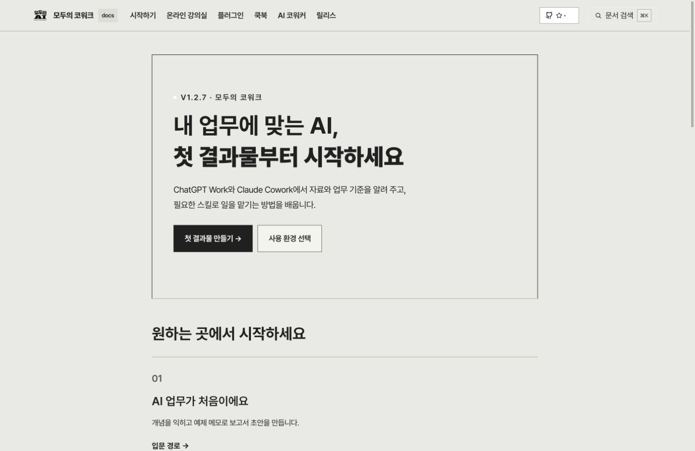
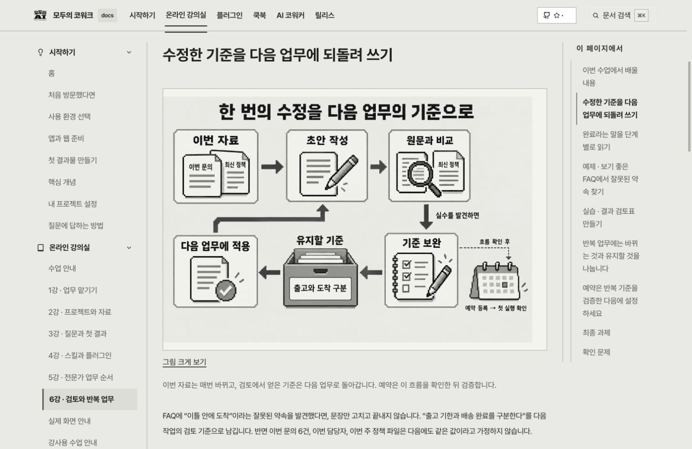
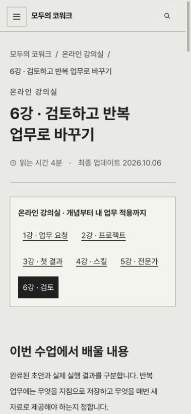

# 킨들 스타일 전체 반영 보고서

## Claim · 반영한 내용

확정한 킨들 배경, Pretendard 한글·영문, 픽셀 그림 스타일을 문서 사이트에 적용했다. 본문 171개와 생성된 페이지·별칭·자료 페이지를 포함한 HTML 288개를 대상으로 확인했다. 기존 조사에서 분류한 86개 개념을 바탕으로 그림의 형식과 배치를 정리했다.

| 항목 | 반영 내용 |
|---|---|
| 색과 형태 | 회백색 바탕 `#e9e9e5`, 읽는 면 `#f4f4ef`, 잉크 `#202020`. 각진 테두리, 그림자·그라디언트·모션 제거 |
| 글꼴 | 로컬 Pretendard Variable 1.3.9와 OFL 라이선스. 일본어·중국어는 Google Noto Sans JP·SC·TC 연결과 언어별 지정 |
| 읽기 | 본문 최대 폭 800px, 기본 본문 16px, 줄 간격 2. 표·그림·도식은 자체 영역에서 가로 이동 |
| 일반 문서 | 본문에 중복되던 텍스트 카드 그림 블록 108개 제거. 정의·비교·요청 예시는 기존 표·목록·코드로 제공 |
| 원리 도식 | 질문과 보류, 지침 적용, 읽기와 저장, 작업 인계, 사용량, 문제 해결, 인증, 로컬·원격 연결, 역할·스킬 관계, 첫 업무 등 10종을 20곳에 배치 |
| 픽셀 그림 | 프로젝트와 폴더, 순차·병렬 분업, 검토 기준의 재사용 3종을 7곳에 배치. 그림 바로 아래에 화살표를 읽는 방법과 구체적인 예를 설명 |
| 수치 그림 | 가상 자료를 사용하는 5개 페이지에 문의 수와 완료 수를 공통 눈금으로 표시. 원자료 표와 전체 비율 계산식을 함께 제공 |
| 실제 화면 | 실제 촬영 화면은 픽셀 그림과 구분해서 기존 촬영 자료로 제공. 그림 설명을 반복하던 자동 푸터 제거 |
| 강의 자료 | 독립된 실습 자료 다운로드 페이지에도 같은 색·글꼴 적용 |
| 운영 기준 | `www/design-system/README.md`와 문서 작성 가이드 개정. 확정 토큰·Mermaid 설정을 기준으로 재생성 |

기존 파일을 측정한 기준선 중 Markdown 128개와 활성 CSS·템플릿 12개가 달라졌다. 이 수치는 새 파일과 보관 이동을 포함한 전체 Git 변경 수가 아니다. 이전 그림 189개는 해시를 유지하여 이 보고서의 `archived-infographics/`에 보관했다.

### 그림으로 원리를 설명하는 방법

반복 업무 그림은 이번 문의와 최신 정책이 초안으로 들어가는 길, 원문과 결과를 비교하는 단계, 발견한 실수를 다음 지침으로 돌려보내는 순환을 보여 준다. “출고와 도착을 구분한다”는 계속 쓸 기준이지만 이번 문의 6건은 새 자료로 바뀐다는 점을 본문 예시로 설명한다. 예약은 이 흐름을 확인한 뒤 등록하고 첫 실행 기록과 결과 파일을 따로 확인하는 다음 단계로 그렸다.

분업 그림에서는 분석이 끝난 뒤 FAQ와 안내문 작성만 나란히 놓았다. 두 초안이 합쳐진 뒤 검토가 시작되고, 수정 의견은 작성 단계로 돌아간다. 각 작업의 입력·출력·시작 조건은 본문의 역할 표와 연결한다. 별도 에이전트를 실행할 수 없는 환경에서는 같은 역할과 기준으로 순서대로 수행한다는 설명을 유지했다.

자료 비율 그림은 A지역 문의 30건 중 완료 24건, B지역 20건 중 10건을 문의 수에 비례한 막대 길이로 그렸다. 전체 완료율이 단순 평균 65%가 아니라 `34÷50×100=68%`인 이유를 그림과 원자료 표로 설명한다. 수업용 가상 자료임을 표시한다.

### 검사에서 확인하고 고친 문제

- Mermaid 자동 시작과 새 초기화가 겹쳐 렌더된 내용을 다시 읽는 오류: 전용 `kindle-mermaid` 클래스를 사용하고 글꼴 로딩 후 한 번만 렌더하도록 수정했다.
- 과거 릴리스의 괄호가 포함된 라벨 파싱 오류: 11개 페이지에서 라벨을 인용부호로 감쌌다. 릴리스 본문의 사실과 수치는 바꾸지 않았다.
- 코드 복사 시 줄 사이에 빈 줄이 더 들어가는 현상: 표시용 `innerText`보다 원문 `textContent`를 먼저 사용하도록 수정했고 실제 클립보드 내용을 비교했다.
- 옛 홈 스타일의 흰 강조 글자와 어두운 버튼 글자, 낮은 대비의 코드 언어 배지: 현재 색·크기와 대비로 수정했다.
- 로컬 개발 서버의 CSS 변경 뒤 HTML에 남은 이전 캐시 키: 새 빌드와의 차이를 확인한 뒤 서버를 재시작하고 전체 응답을 다시 비교했다.

## Evidence · 명령과 실제 결과

### 빌드와 문서 구성

```sh
hugo --source www --destination /tmp/moai-kindle-rollout-final-20261006 --baseURL http://127.0.0.1:1313/ --enableGitInfo=false --quiet
python3 scripts/check-docs.py /tmp/moai-kindle-rollout-final-20261006 --report reports/20261006-kindle-rollout/site-check.json
node --check www/static/js/moai-mermaid.bundle.js
git diff --check -- www/layouts www/static www/content www/design-system
```

빌드·JavaScript 문법·공백 검사는 각각 종료 코드 0이었다. 문서 검사 원문은 `site-check.stdout`과 `site-check.json`에 있다. HTML 288개, 수업 6개, 실습 문의 6행과 예제 계산을 검사했고 `"errors": []`였다.

### 실제 로컬 서버

```sh
python3 reports/20261006-kindle-rollout/http-check.py
```

```json
{"checked": 451, "HTTP_200": 451, "build_matches": 451, "mismatches": []}
```

서버가 넣는 개발용 livereload 스크립트와 HTML 공백 차이를 제외하고 빌드와 비교했다. CSS·JavaScript·글꼴·그림·촬영 화면·실습 파일은 바이트를 그대로 비교했다. HTML 응답의 UTF-8 디코딩도 통과했다.

### 실제 브라우저

CUA로 각 URL을 열고 `html[data-fonts-loaded="true"]`, 도식의 `data-rendered="true"`, 계산된 CSS, 글자·노드 경계, 중복 ID와 ARIA 참조를 관측했다. 화면 변경과 조작은 브라우저 API로 수행했다. 측정 기록은 다음과 같다.

| 범위 | 실제 관측 파일 | 결과 |
|---|---|---|
| 모바일 전체 288개 페이지, 요청 폭 390px | `browser-mobile.json`, `browser-text-crops.json` | 가로 넘침·일반 본문 잘림·도식 글자 잘림 0 |
| 도식 페이지 47개, 요청 폭 1440px | `browser-diagrams.json` | 모두 정상 렌더, 글꼴 로딩 확인, 글자 잘림·중복 ID·깨진 ARIA 참조 0 |
| 강의·업무 흐름 등 22개 페이지, 요청 폭 768px | `browser-tablet.json` | 가로 넘침·본문 잘림·도식 글자 잘림 0 |
| 강조 문구·버튼·본문 등 12개 주요 화면 | `browser-leaf-contrast.json` | 글자 1,085개, 최소 대비 6.12:1, 4.5:1 미만 0 |
| 실제 조작 | `interactions.json` | 원문과 복사 내용 일치, 답안 열림, 그림 키보드 이동, 메뉴 열기·닫기, 검색 결과 24개, CSV 다운로드 6행 |

요청한 폭과 실제 문서 폭은 스크롤바·브라우저 상태에 따라 다르므로 각 기록의 `width`와 `body_width`를 사용한다. 전체 폭 검사는 페이지 경계를, 도식 검사는 SVG와 노드 경계를, 본문 잘림 검사는 표·그림·코드의 의도된 내부 이동 영역을 제외한 일반 글자의 경계를 확인했다.

넓은 범위 검사 후 홈 강조 글자·버튼과 코드 배지를 추가 수정했다. 해당 부분은 최종 주요 화면 대비 검사와 `home-final.json`, 현재 화면 촬영으로 다시 확인했다. 초기 관측 파일의 홈 본문 크기 15.5px은 수정 전 값이며 현재 홈 소개문은 18px이다.

```sh
python3 reports/20261006-kindle-rollout/verify.py
```

```json
{"built_pages": 288, "mobile_pages": 288, "desktop_diagram_pages": 47, "tablet_pages": 22, "page_overflow": 0, "svg_text_clips": 0, "body_text_crops": 0, "duplicate_ids": 0, "broken_svg_aria": 0, "leaf_contrast_pages": 12, "leaf_texts": 1085, "min_leaf_contrast": 6.12, "copy_exact": true, "download_rows": 6, "search_results": 24, "http_200_and_build_match": 451, "archived_assets_unchanged": 189, "removed_card_blocks": 108}
```

### 실제 문서 화면







## Baseline-attribution · 측정한 기준선

- 작업 경로: `/Users/goos/.codex/worktrees/b0aa/moai-cowork`
- 시작 및 종료 확인 HEAD: `2c3cef1d24e88b3bfe8db61c713ffae317b346d0`, detached HEAD.
- source session: `01a10aae-6716-7681-b5d7-d558155d9f86`.
- 수정 전 본문·활성 CSS·템플릿 208개 해시: `baseline.json`.
- 현재 페이지별 그림 배치와 본문 해시: `page-implementation.json`.
- 원래 Mermaid 엔진·현재 초기화 설정·로컬 글꼴 해시: `www/design-system/kindle-provenance.json`.
- 최종 빌드: `/tmp/moai-kindle-rollout-final-20261006`.
- 실제 서버: `http://127.0.0.1:1313/`. Hugo server 세션을 유지했다.

이전 플러그인 검사나 다른 시안의 측정 수치를 이번 검증으로 사용하지 않았다.

## Gaps · 이번에 관측하지 않은 범위

- 운영 사이트 배포, 원격 CI, Git 커밋·푸시는 이 작업에서 수행하지 않았다.
- ChatGPT Work·Claude Cowork의 실제 업무 실행과 계정별 제품 기능은 이번 스타일 작업에서 재검증하지 않았다. 문서 사이트 검증을 앱 기능 검증으로 해석하지 않는다.
- 실제 Kindle 기기, 다른 브라우저, 인쇄물, 스크린 리더, 일본어·중국어 조판은 관측하지 않았다. Noto CJK 연결과 언어 지정은 구현했지만 전체 언어의 렌더링 결과를 주장하지 않는다.
- 픽셀 그림의 글자 경계·대비는 자동 OCR로 측정하지 않았다. 생성 결과의 한글과 화살표를 눈으로 확인했고 원문에 없는 문장과 불필요한 푸터를 제거했다.
- 모든 페이지의 모든 자식 글자 대비를 측정했다는 주장은 하지 않는다. 12개 주요 화면의 자식 글자·버튼 검사 범위를 따로 기록했다. 추가 전수 대비 일괄 호출은 시간 제한으로 기록을 완료하지 못했으며 성공 근거로 사용하지 않았다.

## Residual-risk · 유지보수 시 확인할 내용

- 브라우저 폭이 좁으면 큰 그림 전체를 한 번에 보지 못한다. 그림 영역의 키보드 이동, 원본 확대 링크, 본문 설명을 함께 제공한다.
- Mermaid 엔진의 시작 코드가 바뀌면 `build-kindle.py`가 중단하도록 했다. 테마 업데이트 후 엔진·글꼴·설정을 함께 다시 렌더 검사해야 한다.
- Google Fonts를 사용할 수 없으면 일본어·중국어는 이용자의 대체 글꼴로 표시될 수 있다. 한글·영문 Pretendard는 사이트에서 제공한다.
- 실습 자료와 제품 화면이 바뀌면 그림·본문·자료 표의 의미와 기준일을 함께 다시 확인해야 한다.
