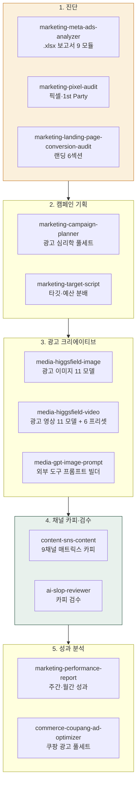
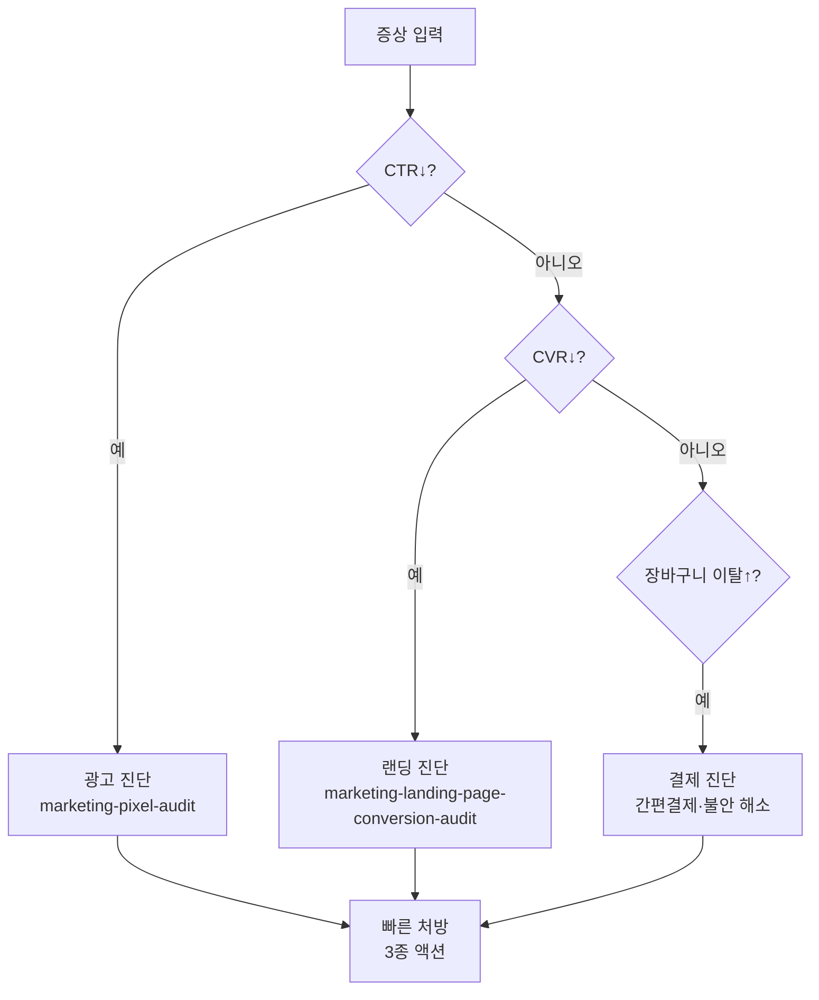
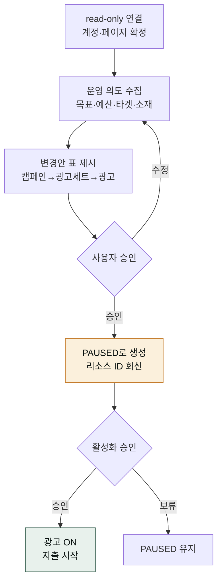

> **대상**: 메타·구글·쿠팡 광고 운영자, 퍼포먼스 마케터, 광고 대행사
> **전제**: moai-coworker · moai-marketer 활성화 + (선택) Meta 광고 AI 커넥터(공식 OAuth) 또는 `META_ACCESS_TOKEN`
> **소요**: 시나리오당 약 5-15분

## 무엇을 할 수 있나



## 한 줄 요청 예시 4종

| # | 한 줄 요청 | 자동 체인 |
|---|---|---|
| 1 | "신상품 메타 광고 3주차 보고서 분석해줘" | marketing-meta-ads-analyzer → 9 모듈 분석 → DOCX |
| 2 | "광고 떨어지는데 뭐가 문제야? 픽셀·랜딩 진단해줘" | marketing-pixel-audit → marketing-landing-page-conversion-audit → 진단 리포트 |
| 3 | "스킨케어 메타 광고 영상 풀세트 만들어줘" | media-higgsfield-image → media-higgsfield-video → content-sns-content → ai-slop-reviewer |
| 4 | "쿠팡 광고 최적화 가이드 짜줘" | commerce-coupang-ad-optimizer → 3 캠페인 분류 → 자동규칙 3종 |
| 5 | "신상품 메타 광고 캠페인 만들어서 운영해줘" | marketing-meta-ads-manager → OAuth 연결 → 캠페인·광고세트 생성(PAUSED) → 승인 → 활성화 |

---

## 시나리오 ① 메타 광고 .xlsx 보고서 분석 (약 10분)

**상황**: 메타 광고관리자에서 추출한 3개월 .xlsx 보고서 분석.

### 사용자 입력


내 브랜드 3개월 메타 광고 보고서 분석해줘. .xlsx 첨부.


### 시스템 인터뷰

1. **사용자 그룹** (HARD 명시 입력, 자동 추정 없음): 인하우스 / 대행사 / 소규모
2. **분석 모드**: 단일 캠페인 / 통합 분석 / 다중 월 비교 / 다중 캠페인 일괄
3. **출력 형식**: HTML(Recharts) / DOCX(8섹션) / PPTX(10-15장) / MD
4. **강도별 액션 옵션** 표시:  보수안 /  중도안 /  적극안 모두 / 권장만

### 자동 체인

`marketing-meta-ads-analyzer` → 9 모듈 (퍼널·KPI·차원·매트릭스·누수·라이프사이클·학습·예산·시뮬레이션) → 4D 교차 (광고×지면×연령×성별) → 50-check audit matrix → 출력 4 형식

### 산출물

- 7-Level 출력 계층 (한 줄 요약 → 영역별 진단 → 강도별 액션 → 시나리오 시뮬)
- 한국 벤치마크 매핑 (CPC ₩500-1,500, ROAS 1.5-2.5, 업계 평균 1.80 참고치)
- 5 규제 검사 (PIPA · ITNA · 전상법 · 표시광고법 · 식약처)

---

## 시나리오 ② 광고 떨어지는데 원인 찾기 (약 8분)

### 사용자 입력


메타 광고 CTR 1% 미만 떨어졌어. 원인 찾아줘


### 시스템 인터뷰

1. **현황**: 캠페인명 · 기간 · 예산 · 현재 ROAS
2. **진단 범위**: 픽셀 / 랜딩 / 카피 / 타깃
3. **장바구니 이탈률** 알고 있는가?

### 자동 진단 분기



### 자동 체인

`marketing-pixel-audit` (메타·구글 픽셀 설치 검증 + 3종 실수 점검: 구매자 미제외/이벤트 파라미터/CAPI) → `marketing-landing-page-conversion-audit` (6섹션: 히어로·공감·증명·사회증거·CTA·FAQ) → 빠른 처방 3종

---

## 시나리오 ③ 광고 영상 풀세트 (약 15분)

### 사용자 입력


스킨케어 메타 광고 영상 풀세트 만들어줘. 의심차단형 후크


### 시스템 인터뷰

1. **카테고리** (영상 모델 추천: 의류·식품=Kling / 뷰티=Veo 3 / 생활용품=Seedance)
2. **광고 목적**: 인지도 / 클릭 / 전환
3. **후크 유형**: 의심차단형 / 호기심 / 권위 / 사회증거
4. **채널**: 메타 1:1·9:16 / 네이버 GFA / 카카오모먼트 1:1·16:9

### 자동 체인 (광고 풀세트)

```text
media-higgsfield-image  → 광고 이미지 세트 (Hero·인포·라이프스타일·CTA — Soul·DOP·Character 계열, Higgsfield 22 모델)
media-higgsfield-video  → 메인 영상 5-10초 + 보조 2컷 (Kling·Veo 3·Seedance 등 11 모델 + 6 프리셋)
content-sns-content     → 메타 1:1·9:16 / 네이버 GFA / 카카오모먼트 1:1·16:9 채널별 카피
ai-slop-reviewer        → 카피 검수 (AI 티 제거)
```

AI 생성 소재는 채널별 "AI 생성" 표기 정책에 맞춰 캡션·메타데이터에 명시하세요 (광고심의·소비자보호법 대응).

### 산출물 + 비용

- 광고 이미지 세트(Hero·인포·라이프스타일·CTA) + 메인 영상 1편 + 보조 영상 2컷 + 채널별 카피
- 비용 추정: ₩2,300-4,000/상품 1건 (Higgsfield 종량제 기준)

---

## 시나리오 ④ 쿠팡 광고 풀세트 최적화 (약 10분)

### 사용자 입력


쿠팡 광고 최적화 가이드 짜줘. 우리 광고비 3.6억


### 시스템 인터뷰

1. **3 캠페인 유형**: AI스마트 / 매출최적화 / 수동키워드
2. **검색영역 vs 비검색영역**: 매출 분리 분석 (CPM 167배 차이)
3. **현재 ROAS·CTR·CVR**
4. **엔드 ROAS(본전 ROAS)** 자동 계산

### 자동 체인

`commerce-marketplace-coupang-ads` → 3 캠페인 분류 + 자동규칙 3종 가이드 (골든타임/350%이상 증액/100%미만 알림) + 상품별 의사결정 분기

### 산출물

- 쿠팡 광고 월 매출 분석 + 최적화 로드맵 + 자동규칙 설정 가이드
- 검색·비검색 영역 분리 분석 + 본전 ROAS 기반 의사결정 분기

---

## 시나리오 ⑤ 메타 광고 직접 운영 — 공식 커넥터 (약 10분)

**상황**: 보고서 분석이 아니라 메타 광고를 **직접 만들고 운영**한다. Meta 공식 **Ads AI Connectors**(OAuth 커넥터)에 연결해 자연어로 캠페인·광고세트·광고를 생성·수정·예산조정·온오프한다. 보고서 분석(`marketing-meta-ads-analyzer`)과 명확히 구분되는 **라이브 운영** 시나리오다.

### 0. 사전 연결 (최초 1회)

Meta 공식 Ads AI Connectors(2026-04-29 오픈 베타)를 OAuth로 연결한다. 앱 생성·앱 심사·토큰 복사가 **필요 없다**.

1. Cowork 설정 → 커넥터 → 커스텀 커넥터 추가 → URL `https://mcp.facebook.com/ads`
2. 브라우저에서 **Meta Business OAuth 로그인** (필요 시 2FA)
3. 공유할 광고 계정·페이지 + 권한 등급 선택 (read-only로 시작 권장)

> `moai-marketer` 설치 시 `meta-ads`가 `.mcp.json`에 미리 등록되어 있어 URL 입력이 생략된다. Claude 재시작 후 첫 호출 시 OAuth 로그인만 진행하면 된다. 자세히는 .

### 사용자 입력


신상품 비타민 메타 광고 캠페인 만들어서 운영해줘. 일예산 5만원, 전환 목표.


### 시스템 인터뷰

1. **광고 계정·페이지 확정** (read-only로 목록 조회 후 선택)
2. **목표**: 전환 / 트래픽 / 도달 / 참여
3. **예산**: 일예산 / 총예산 + 집행 기간
4. **타겟**: 지역·연령·관심사 / 기존 커스텀 오디언스
5. **소재**: 이미지·영상·문구 (없으면 `moai-media` 체이닝 제안)

### 워크플로우 (안전 우선)



### 안전 가드 (HARD)

| 가드 | 규칙 |
|---|---|
| 기본 PAUSED | 자연어로 생성한 신규 캠페인·광고세트·광고는 **항상 PAUSED**. 자동 활성화 금지. |
| 활성화 승인 | 광고를 켜거나 지출 시작 전 사용자 명시 확인. |
| 쓰기 승인 | 모든 쓰기·예산·결제 동작은 실행 전 승인 (커넥터도 동작별 승인 요구). |
| 권한 최소화 | read-only로 시작, 운영 시에만 read+write, 결제는 financial 등급에서만. |

### 자동 체인

```text
marketing-meta-ads-manager (생성·운영, PAUSED)
  → (성과 누적 후) marketing-meta-ads-analyzer (진단)
  → ai-slop-reviewer (진단 텍스트 검수)
```

### 산출물

- 변경안 표 (캠페인→광고세트→광고, 예산, 상태=PAUSED)
- 실행 결과: 생성된 리소스 ID·상태, 적용된 변경 요약
- 활성화 후 성과 조회: spend / impressions / CTR / ROAS + breakdown

---

## AskUserQuestion 표준 슬롯 (광고 트랙 공통)

| 슬롯 | 예시 값 |
|---|---|
| 사용자 그룹 | 인하우스 / 대행사 / 소규모 (HARD 명시) |
| 카테고리 | 식품·뷰티·건강기능식품·IT·가정용품·교육·B2B·기타 |
| 분석 기간 | 1주 / 4주 / 12주 / 6개월 |
| 출력 형식 | HTML / DOCX / PPTX / MD |
| 강도별 액션 |  보수 /  중도 /  적극 / 권장만 |
| 규제 검사 자동 | PIPA·ITNA·전상법·표시광고법·식약처 |

---

## 자주 묻는 질문

### Q. `META_ACCESS_TOKEN` 없이도 분석 가능한가요?

예. **`.xlsx` 업로드 fallback** 자동 동작. Meta 공식 MCP는 OAuth 필요하지만 비활성 환경에서도 모든 분석 가능.

### Q. 한국 벤치마크 출처는 정확한가요?

`marketing-meta-ads-analyzer` 내장 한국 벤치마크는 일반 참고용. 자사 카테고리·시장 데이터로 보정 권장.

### Q. 식약처 광고 심의 자동 검출되나요?

예. 카테고리가 식품·건강기능식품이면 `commerce-ad-claim-compliance-kr`이 자동 활성화됩니다.

### Q. 광고를 직접 만들면 바로 집행되나요?

아니요. `marketing-meta-ads-manager`로 만든 신규 캠페인·광고세트·광고는 **항상 PAUSED**로 생성됩니다. 활성화·예산 증액·결제는 실행 전 사용자 승인을 거칩니다. 안심하고 초안을 만들어 검토할 수 있습니다.

### Q. 공식 커넥터 연결에 개발자 앱이 필요한가요?

아니요. Meta 공식 Ads AI Connectors는 OAuth 2.0 커넥터 흐름을 씁니다. 커넥터 URL(`mcp.facebook.com/ads`) 등록 후 브라우저에서 Meta Business 로그인만 하면 됩니다 — 개발자 앱 생성·앱 심사·토큰 수동 복사가 필요 없습니다. (개발 환경에서만 `META_ACCESS_TOKEN` 정적 토큰을 fallback으로 씁니다.)

---

## 다음 단계

- **[콘텐츠 트랙](../track-content/)** — 광고용 콘텐츠 생성
- **[이커머스 트랙](../track-commerce/)** — 광고 + 상품 통합
- **[moai-marketer 플러그인](/moai-agents/marketer/)**
- **[marketing-meta-ads-analyzer 스킬](https://github.com/modu-ai/moai-cowork/tree/main/plugins/moai-marketer/skills/marketing-meta-ads-analyzer)**

---

### Sources

- [agricidaniel/claude-ads v1.5.1 (MIT)](https://github.com/AgriciDaniel/claude-ads) — 50-check matrix 방법론
- [Meta 광고 AI 커넥터 — Meta Business Help](https://www.facebook.com/business/help/1456422242197840) — 공식 커넥터
- [Meta for Developers — Introducing the Ads CLI (2026-04-29)](https://developers.facebook.com/blog/post/2026/04/29/introducing-ads-cli/) — 공식 MCP·CLI
- [정보통신망법 + 표시광고법 + 식약처 광고 심의](https://www.law.go.kr) — 5 규제
