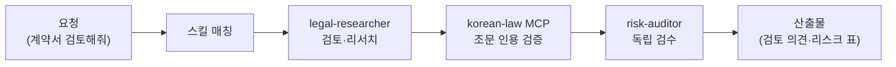

계약서에 도장을 찍기 전, 마음 한구석이 불안했던 경험이 있으실 겁니다. "이 조항, 나한테 불리한 건 아닐까?" 변호사에게 매번 물어보기엔 비용이 부담스럽고, 혼자 읽자니 용어가 낯설죠. 법무 담당은 그 첫 번째 독해를 대신해 주는 코워커입니다. 병원으로 치면 큰 병원에 가기 전 동네 의원에서 받는 1차 진료 같은 역할 — 위험 신호를 미리 짚어 주되 최종 판단은 전문가에게 넘깁니다.

스킬은 계약 검토, NDA(비밀유지계약) 트리아지(여러 건을 위험도 순으로 빠르게 분류하는 작업), 컴플라이언스(법규 준수) 점검, 법령·판례 리서치, 국내외 특허·상표 선행조사와 특허 분석, 식약처 안전 기준 확인, 등기 자동화를 다룹니다. 가장 큰 특징은 국가법령정보 MCP(클로드가 외부 서비스와 연결되는 표준 통로)인 korean-law 연동입니다. 법 조문을 기억에 의존해 말하는 것이 아니라, 실제 법령 데이터베이스에서 조문을 가져와 인용을 검증합니다.

법률 문서는 한 글자 차이로 결론이 달라질 수 있는 영역이라, 검토 결과를 다시 의심하는 검수 코워커가 반드시 붙습니다.

## 스킬 카탈로그

legal-\* 계열 전체 목록입니다.



## 에이전트

**legal-researcher**(실행 코워커)가 계약 검토·법령 리서치·특허 분석을 수행하고, **risk-auditor**(검수 코워커)가 읽기 전용으로 검토 결과와 인용의 정확성을 독립 검증합니다. 법률 영역에서는 "그럴듯한 인용"이 가장 위험하기 때문에, 인용 조문이 실제로 존재하고 현재 유효한지를 별도의 눈이 확인합니다.



## 대표 시나리오 3선

**1. 계약서 1차 검토.** "이 용역계약서에서 우리 쪽에 불리한 조항 찾아줘"라고 하면 `legal-contract-review`가 조항별 위험도를 정리하고, 관련 법령 근거를 korean-law MCP에서 인용해 붙입니다.

**2. NDA 여러 건 빠른 분류.** "거래처 NDA 5건인데 어떤 것부터 봐야 해?"라고 요청하면 `legal-nda-triage`가 위험 조항 유무 기준으로 우선순위를 매겨 "바로 서명 가능 / 협상 필요 / 전문가 검토 필수"로 분류합니다.

**3. 특허 선행 조사.** "이 아이디어랑 비슷한 특허 있는지 찾아줘"라고 하면 `legal-patent-search`가 선행 특허를 검색하고 `legal-patent-analyzer`가 충돌 가능성을 분석합니다.

**4. 상표·특허 국내외 조사 보고서.** "이 브랜드명 한국·미국·일본에 상표 등록할 수 있을지 조사해줘"라고 하면 `legal-ip-search-report`가 먼저 기관별 API 키가 설정됐는지 확인합니다. 키가 없으면 검색하지 않고 기관별 등록 방법부터 알려 드리고, 설정이 끝나면 공식 DB로 조사해 검색 기록·위험 평가·출원 전략이 담긴 보고서를 만듭니다. 미국 상표 문자 검색과 일본 키워드 검색은 공식 API가 없어 웹 화면으로 보완하며, 보고서에 그 부분을 따로 표시합니다.

**잘 안 될 때** — 법령 인용이 나오지 않으면 korean-law MCP 연결 상태를 먼저 확인하세요. MCP 없이도 검토는 가능하지만 조문 인용 검증 단계가 빠져 신뢰도가 낮아집니다.

## MCP 연동

- **korean-law** — 국가법령정보센터 기반 법령·판례·자치법규 검색과 조문 원문 조회. 공개 API 기반으로 동작합니다.
- **moai-mcp-ip** — 특허·상표 공식 데이터. KIPRIS Plus(한국), USPTO(미국 특허 검색·상표 상태), 일본 특허청(번호 기반 조회), EPO(유럽·국제 특허 검색·패밀리·법적 상태)를 조회합니다. 기관이 공식 MCP를 제공하지 않아 모두의 AI가 직접 만들었습니다. 필요한 기관만 API 키를 등록하면 되고, 키는 [MCP 자격증명 넣기](/plugins/mcp/credentials/)의 방법으로 넣습니다.


법무 담당의 산출물은 **법률 자문을 대체하지 않는 참고 자료**입니다. 계약 체결, 소송, 규제 대응 등 법적 효력이 발생하는 결정은 반드시 변호사 등 자격 있는 전문가의 자문을 거치세요.

