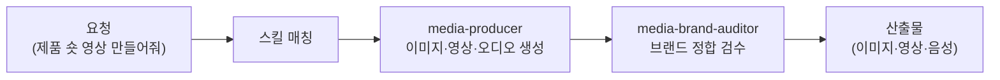

콘텐츠에 이미지·영상·음성이 들어가면 퀄리티가 확 달라집니다. 하지만 생성 도구마다 프롬프트 문법이 다르고, 계정도 따로입니다. 미디어 크리에이터는 이 멀티모달 생성을 한 코워커 안에 모아 둔 역할입니다. 스튜디오의 크리에이티브 디렉터처럼, 무엇을 만들지 정하고 알맞은 도구를 골라 호출합니다.

Higgsfield 계열(media-higgsfield-*)은 이미지·영상에 더해 3D 메시(GLB)·오디오·완성 영상 분석, 10초 블록 조립형 설명 영상, 제품 촬영 10모드, 그리고 같은 인물·캐릭터를 여러 컷에 일관되게 넣는 참조 학습(Soul / Element)까지 다룹니다. 오디오 계열(media-audio-gen)은 ElevenLabs 음성 생성을 담당합니다. 프롬프트 빌더 계열(media-gpt-image-prompt / media-gemini-3-image-prompt / media-midjourney-v8-prompt)은 각 모델에 맞춘 완성 프롬프트를 만들어 주고, media-notebooklm-slide-prompt는 NotebookLM Studio 슬라이드를 위한 프롬프트를 만듭니다. media-codex-image는 프롬프트가 아니라 codex CLI로 이미지를 직접 생성하는 스킬입니다(GPT Image, ChatGPT OAuth 인증으로 API 키 없이). 이전 버전에서 마케터로부터 미디어 생성 도메인이 분리되어 신설되었습니다. Higgsfield·ElevenLabs MCP가 연동됩니다.

브랜드 톤과 시각 일관성이 중요한 작업인 만큼, 산출물이 브랜드에 맞는지 검수하는 코워커가 붙어 있습니다.

## 스킬 카탈로그

media-* 계열 생성 스킬의 전체 목록입니다.



## 에이전트

**media-producer**(실행 코워커)가 이미지·영상·오디오를 생성하고, **media-brand-auditor**(검수 코워커)가 산출물이 브랜드 톤·일관성 기준에 맞는지 검수합니다.



## 대표 시나리오 5선

**1. Higgsfield 시네마틱 숏.** "이 제품 15초 시네마틱 숏으로 만들어줘"라고 하면 `media-higgsfield-video`가 Higgsfield MCP로 영상을 생성합니다. 사전에 예상 크레딧을 고지합니다.

**2. 이미지 프롬프트 빌드.** "이 캠페인 키비주얼을 GPT-image와 Midjourney용 프롬프트로 뽑아줘"라고 하면 `media-gpt-image-prompt`·`media-midjourney-v8-prompt`가 각 모델에 맞춘 완성 프롬프트를 제공합니다.

**3. 음성 광고 제작.** "20초 음성 광고 스크립트 음성으로 만들어줘"라고 하면 `media-audio-gen`이 ElevenLabs로 음성을 생성합니다.

**4. 캐릭터 일관성 확보.** "이 캐릭터가 모든 컷에 똑같이 나오게 해줘"라고 하면 `media-higgsfield-identity`가 먼저 경로를 가릅니다. 한 사람을 단독으로 쓰면 Soul 학습(사진 5~20장, 약 10분), 두 명 이상이 한 컷에 나오거나 제품·배경이면 Element입니다. 한 생성에 Soul은 하나만 들어가므로, 2인 컷은 Soul로 만들 수 없습니다. 판정이 애매하면 학습을 시작하지 않고 되묻습니다.

**5. 설명 영상 제작.** "이 주제로 3분짜리 내레이션 영상 만들어줘"라고 하면 `media-higgsfield-explainer`가 10초 블록 18개로 나눠 내레이션과 화면을 1:1로 짝지어 만든 뒤 서버에서 조립합니다. 스타일을 먼저 고르고 나머지 설정을 정하는 2단계 질문 순서를 지킵니다.

**잘 안 될 때** — Higgsfield 생성 실패 시 프롬프트 온리 폴백으로 전환합니다. OAuth 인증은 [Higgsfield MCP 설정](/plugins/higgsfield-setup/)을 참고하세요.

## MCP 연동

- **higgsfield** — 이미지·영상 생성. Higgsfield OAuth 인증이 필요합니다 ([설정 가이드](/plugins/higgsfield-setup/)).
- **ElevenLabs** — 텍스트 음성 변환·보이스 클로닝. ElevenLabs API 키가 필요합니다.
