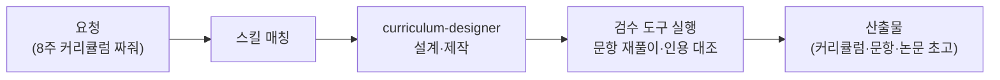

가르치는 일의 뒤편에는 보이지 않는 노동이 산더미입니다.
커리큘럼 짜기, 강의 자료 만들기, 시험 문항 출제, 수강생 후속 관리.
연구자라면 여기에 논문 검색과 초고 작성이 얹히죠.
튜터는 이 교육·연구의 뒤편 노동을 받아 주는 코워커입니다.
학교로 치면 수업 준비를 함께하는 교육 조교이자,
연구실의 성실한 랩 어시스턴트입니다.

스킬은 교육 설계와 연구를 함께 다룹니다.
교육 설계 쪽은 커리큘럼, 학습 자료, 평가 문항, 강좌 운영, 수강 후 안내를,
연구 쪽은 논문 검색·작성, 연구 보조, 연구비 신청서 초안을 다룹니다.
학습 프로젝트 설계도 지원해서,
"이 주제를 3개월 안에 독학하고 싶어" 같은 요청도 받습니다.

문항의 정답과 인용은 별도 검수가 필요합니다.
Claude Cowork의 `assessment-auditor`나 ChatGPT Work의
`education-assessment-audit`를 실제로 실행해 재풀이·출처 대조 근거를 남긴
경우에만 검증 완료로 표시합니다.

## 스킬 카탈로그

education-\* 계열 스킬의 전체 목록입니다.



## 에이전트

**curriculum-designer**(실행 코워커)는 커리큘럼·학습 자료·평가 문항을 설계합니다.
Claude Cowork에서 별도 **assessment-auditor**를 실행하면 문항 정답과 인용을
독립 검수할 수 있습니다. ChatGPT Work에서는 `education-assessment-audit`
스킬의 검수 기준을 따르며, 같은 대화에서 자기 결과를 확인했다면
독립 감사라고 부르지 않습니다.



## 대표 시나리오 3선

**1. 강좌 개설 준비.** "직장인 대상 엑셀 입문 8주 과정 만들어줘"라고 하면
`education-curriculum-designer`가 주차별 목표와 실습을 설계하고,
`education-learning-material`이 자료를,
`education-course-operations-manual`이 운영 매뉴얼을 만들어 줍니다.

**2. 시험 문항 출제.** "이 강의 자료로 중간 평가 20문항 출제해줘.
난이도 섞어서"라고 요청하면 `education-assessment-creator`가 문항과 해설을
만듭니다. 정답 오류와 중의적 표현은 검수를 실제로 실행한 범위에서만
확인했다고 표시합니다.

**3. 논문 리서치와 초고.** "이 주제 관련 최근 연구 찾아서 선행연구 정리해줘"라고
하면 `education-paper-search`가 문헌을 찾고,
`education-research-assistant`·`education-paper-writer`가 선행연구 정리와
초고 작성을 돕습니다.

**잘 안 될 때** — 커리큘럼이 너무 일반적으로 나오면 수강생 정보를 구체화하세요.
"왕초보인지 중급인지, 주당 몇 시간 쓸 수 있는지, 최종 목표가 무엇인지"
세 가지만 알려 줘도 결과가 확 달라집니다.
논문 인용은 사용 전 원문 존재 여부를 반드시 직접 확인하세요.
