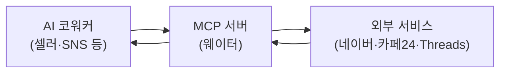

지금까지는 AI 코워커가 **글을 써 주는** 일을 했습니다. MCP를 붙이면 여기서 한 걸음
더 나갑니다 — 실제로 **스마트스토어 주문을 조회하고, 아임웹·카페24 상품을 다루고,
Threads에 글을 발행**합니다.

## MCP가 뭔가요

**MCP** — Model Context Protocol — 는 AI가 외부 서비스와 이야기하는 **표준 통로**입니다.

식당에 비유하면 이렇습니다. 손님(AI 코워커)이 주방(스마트스토어·Threads 같은 서비스)에
직접 들어갈 수는 없습니다. 대신 **웨이터**가 주문을 받아 주방에 전하고 음식을 가져옵니다.
MCP 서버가 그 웨이터입니다.

웨이터가 없으면 코워커는 "이렇게 하세요"라고 안내만 할 수 있습니다. 웨이터가 있으면
직접 해 드립니다.

## 두 종류가 있습니다

| 구분 | 누가 만들었나 | 이름 | 예 |
|---|---|---|---|
| **공식·제3자 MCP** | 서비스 회사 또는 다른 개발자 | 원래 이름 그대로 | Higgsfield · ElevenLabs · 국가법령정보 |
| **자체 제작 MCP** | 모두의 AI | `moai-mcp-` 로 시작 | `moai-mcp-smartstore` · `moai-mcp-threads-poster` · `moai-mcp-ip` |

**공식 MCP가 있으면 무조건 그걸 씁니다.** 직접 만드는 것은 공식 MCP가 없을 때뿐입니다 —
네이버 스마트스토어·아임웹·카페24처럼 공식 MCP가 없는 국내 서비스가 그런 경우입니다.

제3자 MCP의 이름은 바꾸지 않습니다. 이름을 바꾸면 그게 어디서 왔는지 알 수 없게 되기
때문입니다. 참고한 프로젝트는 [오픈소스 크레딧](../open-source/)에 전부 밝혀 두었습니다.

## 어디서 쓸 수 있나요

macOS와 Windows, Claude Cowork(데스크톱)와 ChatGPT Work — **네 조합 모두**에서 동일하게
동작합니다. 특정 운영체제에만 있는 명령을 쓰지 않고, 경로도 양쪽에서 통하는 방식으로만
조립합니다.

## 시작하기

| 문서 | 내용 |
|---|---|
| [설치와 설정](install/) | 사전 준비(uv)부터 자격증명 입력, 연결 확인까지 |
| [API 키 넣는 법](credentials/) | 앱 입력창과 자격증명 파일 — 서비스별 항목 이름과 안전 수칙 |
| [문제 해결](troubleshooting/) | 연결이 안 될 때 순서대로 확인할 것 |


**설정하지 않아도 코워커는 작동합니다.** MCP를 붙이지 않은 상태에서는 초안·점검표·원고를
만들어 드리고, 실제 버튼을 누르는 단계는 직접 하실 수 있도록 순서를 안내합니다.
급하지 않다면 나중에 붙이셔도 됩니다.

