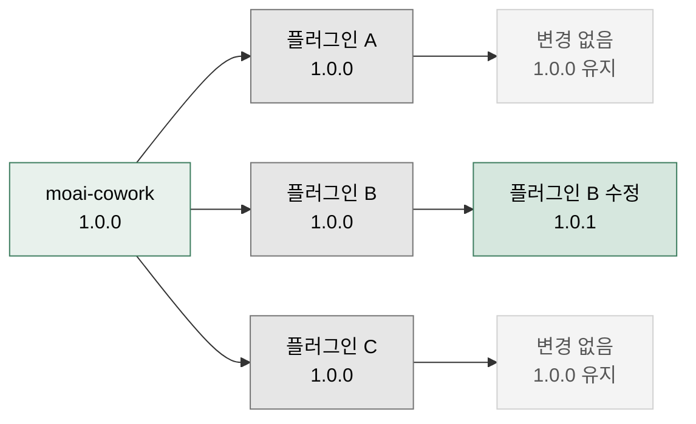

모두의 코워크는 **v1.0.0**에서 새로 출발합니다. 이 페이지는 버전 번호가 어떻게 매겨지고 언제 올라가는지, 그리고 각 릴리스에 무엇이 담겼는지를 안내합니다.

## 버전 관리 정책

### 세 가지 버전이 따로 움직입니다

번호가 하나가 아니라는 점이 핵심입니다. 회사에 비유하면 **회사 자체의 연혁**과 **코워커 개개인의 경력**이 따로 쌓이는 것과 같습니다.

| 대상 | 시작 | 언제 올라가나 |
|---|---|---|
| moai-cowork (마켓플레이스·문서) | 1.0.0 | 사이트·문서·마켓플레이스 구조 자체가 바뀔 때. **플러그인 변경과는 무관합니다** |
| 플러그인 각각 | 1.0.0 | 그 플러그인이 수정될 때만. 손대지 않으면 1.0.0 그대로 |
| 스킬 각각 | 1.0.0 | 그 스킬이 수정될 때 |

예를 들어 마케터 플러그인만 고쳤다면 `moai-marketer`가 1.0.1이 되고, 나머지 플러그인과 moai-cowork는 1.0.0에 그대로 머뭅니다. **번호를 보면 무엇이 바뀌었는지 바로 알 수 있습니다.**

### 버전 형식

세 자리 `MAJOR.MINOR.PATCH`를 씁니다.

- **MAJOR (주 버전)**: 쓰던 방식이 바뀌어 사용자가 적응해야 하는 변경
- **MINOR (부 버전)**: 스킬·기능이 새로 추가됨. 기존 사용법은 그대로
- **PATCH (패치)**: 버그 수정, 문구·품질 개선

각 자리는 100을 넘기지 않습니다. PATCH가 100에 닿으면 MINOR를 올리고 PATCH를 0으로 되돌립니다.

## 릴리스 노트

| 버전 | 날짜 | 내용 |
|---|---|---|
| [v1.2.6](/releases/v1.2.6/) | 2026-09-14 | **특허·상표 선행조사 공식 데이터 조회** · 선행조사 리포트 스킬 신설 · GPT Image 2.5용 프롬프트 스킬 교체 · ChatGPT Work 배선 정비 |
| [v1.2.5](/releases/v1.2.5/) | 2026-09-03 | **넣어 둔 API 키가 코워커에게 닿습니다** · Claude Cowork 키 입력창 · ChatGPT Work 셀러·스레드 연결 복구 · 자격증명 파일 도입 · 코워커 목록 정리 |
| [v1.2.4](/releases/v1.2.4/) | 2026-09-01 | **끊긴 연결 통로 수리** · 건축물대장 조회 복구 · Typefully·WordPress 발행 복구 · 사라진 통로 정리 · ChatGPT Work 선택지 카드 질문 |
| [v1.2.3](/releases/v1.2.3/) | 2026-08-27 | **되돌릴 수 없는 일 앞에서 멈춤** · 목소리·얼굴 업로드 동의 확인 · 크레딧 사전 견적 · 원격 삭제 복구 사본 · 슬라이드 정량 채점 필수화 |
| [v1.2.2](/releases/v1.2.2/) | 2026-08-22 | **안 보이던 코워커 3종 복구** · PM 스킬 0 문제 해결 · 윈도우 준비물 안내 신설 · 슬래시 명령 `/project` 하나로 정리 |
| [v1.2.1](/releases/v1.2.1/) | 2026-08-22 | **윤문 최종 검수 도입** · 한국어 윤문 규칙 실측 교정 · 설치 안내 앱 중심 전환 |
| [v1.2.0](/releases/v1.2.0/) | 2026-08-08 | **오픈소스 크레딧 페이지** · MCP 안내 섹션 신설 · 연결 도구 이름 `moai-mcp-` 통일 |
| [v1.1.0](/releases/v1.1.0/) | 2026-07-31 | **Apache-2.0 전환** · 산출물 권리 명문화 · 제3자 고지·상표 정책 신설 |
| [v1.0.0](/releases/v1.0.0/) | 2026-07-31 | 버전 체계 재정립 · 플러그인 17종 1.0.0 통일 · 문서 디자인 시스템 v2 |


**이전 기록을 찾으신다면**
v1.0 ~ v2.27의 옛 릴리스 노트는 [이전 릴리스 아카이브](/releases/archive/)에 그대로 보관돼 있습니다. 예전 주소(`/releases/v2.27/` 등)로 들어오셔도 자동으로 연결되니 공유해 둔 링크는 그대로 쓰셔도 됩니다.


## 업그레이드 가이드

### 안전하게 올리는 순서

1. **백업** — 작업 중인 폴더를 복사해 둡니다
2. **업데이트** — 두 데스크톱 앱 모두 **플러그인(Plugins) 메뉴 → 해당 코워커 → Update**. 터미널 명령은 [플러그인 설치와 관리](/plugins/install/) 4절 참고
3. **재시작** — 데스크톱 앱을 껐다 켭니다
4. **확인** — 평소 쓰던 요청을 하나 던져 정상 동작을 확인합니다

### 호환성

**v1.0.0은 이전 버전과 완전 호환됩니다.** 버전 번호 체계만 바뀌었고 스킬·기능·사용법은 그대로입니다. 별도로 하실 일은 없습니다.

v2.27 이전의 버전별 호환성 정보는 [아카이브](/releases/archive/)의 각 노트에서 확인하실 수 있습니다.

## 변경 사항 유형

릴리스 노트는 아래 네 갈래로 정리합니다.

- **Added (신규 추가)** — 새 플러그인·스킬·연동·템플릿
- **Changed (변경)** — 기존 스킬 개선, 화면 변경, 성능 향상, 내부 구조 정리
- **Fixed (수정)** — 버그 수정, 안정성·사용성 개선
- **Removed (제거)** — 더 쓰지 않는 기능, 중복 스킬 통합, 오래된 연동 정리

## 릴리스 일정

- **주요 릴리스**: 분기별 (3월·6월·9월·12월)
- **보완 릴리스**: 필요할 때 (보통 매월)
- **긴급 업데이트**: 중요한 버그나 보안 문제가 생겼을 때

## 피드백 및 기여

릴리스 노트에 대한 제안이나 오류 제보는 [GitHub 이슈](https://github.com/modu-ai/moai-cowork/issues)로 알려주세요.

### Sources
- GitHub 저장소: [https://github.com/modu-ai/moai-cowork](https://github.com/modu-ai/moai-cowork)
- 릴리스 노트: [https://github.com/modu-ai/moai-cowork/releases](https://github.com/modu-ai/moai-cowork/releases)
