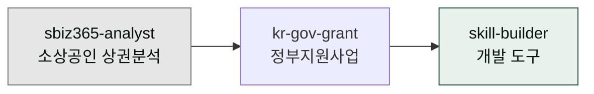

**릴리스 날짜**: 2026-05-01
**버전**: v1.5.1 (최신)
**업데이트 명령**: `/plugin marketplace update cowork-plugins`



## Highlights

이번 v1.5.x 릴리스는 **17개 플러그인, 84개 스킬**로 확장되었으며 특히 **소상공인 비즈니스 지원**과 **스킬 개발 생산성**을 크게 개선했습니다. 한국형 스타트업의 실제 비즈니스 과제 해결에 특화된 두 개의 전문 플러그인이 추가되었고 개발자가 직접 스킬을 만들 수 있는 강력한 도구들이 도입되었습니다. 기존 워크플로우는 그대로 유지되면서 더 많은 비즈니스 시나리오를 커버할 수 있게 되었습니다.

## What's New (추가)

### moai-consultant: sbiz365-analyst (소상공인365 상권분석)

**전체 경로**: `moai-consultant:business-sbiz365-analyst`

**한 줄 기능 요약**: 소상공인365 데이터를 활용한 정확한 상권 분석 보고서 생성

**주요 입출력 및 지원 범위**:
- **입력**: 상권 정보, 업종, 지역 코드
- **출력**: 상권 경쟁력 분석, 잠재고객 예측, 마케팅 전략
- **MODE**: 분석, 예측, 제안
- **지원 범위**: 전국 소상공인 상권 분석, 경쟁사 분석, 수요 예측

**관련 링크**:
- [SKILL.md](https://github.com/modu-ai/cowork-plugins/blob/main/moai-consultant/skills/sbiz365-analyst/SKILL.md)
- [온라인 문서](https://cowork.mo.ai.kr/moai-agents/consultant/)
- [소상공인365 공식 자료](https://www.sbiz.or.kr)

### moai-consultant: kr-gov-grant (정부지원사업 통합 지원)

**전체 경로**: `moai-consultant:business-kr-gov-grant`

**한 줄 기능 요약**: 모든 정부지원사업을 하나로 통합하여 최적 지원사업 매칭

**주요 입출력 및 지원 범위**:
- **입력**: 사업 분야, 규모, 지역, 조건
- **출력**: 맞춤형 지원사업 추천, 신청 가이드라인, 경쟁률 분석
- **MODE**: 분류, 추천, 가이드
- **지원 범위**: 중소벤처기업진흥공단, 지자체 지원사업, R&D 지원

**관련 링크**:
- [SKILL.md](https://github.com/modu-ai/cowork-plugins/blob/main/moai-consultant/skills/kr-gov-grant/SKILL.md)
- [온라인 문서](https://cowork.mo.ai.kr/moai-agents/consultant/)
- [정부지원사업 통합정보](https://www.bizinfo.go.kr)

### moai-coworker: skill-builder (스킬 개발 도구)

**전체 경로**: `moai-coworker:general-skill-builder` *(v1.5.x: skill-forge에서 이름 변경, 별칭 없음)*

**한 줄 기능 요약**: 템플릿 기반의 빠른 스킬 개발 프레임워크

**주요 입출력 및 지원 범위**:
- **입력**: 스킬 아이디어, 도메인, 사용 사례
- **출력**: 완성된 스킬 코드, 테스트 케이스, 문서
- **MODE**: 생성, 테스트, 배포
- **지원 범위**: 16개 언어, 모든 플랫폼, 테스트 자동화

**관련 링크**:
- [SKILL.md](https://github.com/modu-ai/cowork-plugins/blob/main/moai-coworker/skills/skill-builder/SKILL.md)
- [온라인 문서](https://cowork.mo.ai.kr/moai-agents/coworker/)
- [스킬 체이닝 쿡북](/cookbook/skill-chaining/)

### moai-coworker: skill-template (스킬 템플릿 라이브러리)

**전체 경로**: `moai-coworker:general-skill-template`

**한 줄 기능 요약**: 사전 제작된 50+ 스킬 템플릿 즉시 사용

**주요 입출력 및 지원 범위**:
- **입력**: 템플릿 선택, 커스터마이징 변수
- **출력**: 설정된 스킬, 모듈, 예시 코드
- **MODE**: 선택, 수정, 확장
- **지원 범위**: API 스크립팅, 데이터 처리, UI 컴포넌트

**관련 링크**:
- [SKILL.md](https://github.com/modu-ai/cowork-plugins/blob/main/moai-coworker/skills/skill-template/SKILL.md)
- [온라인 문서](https://cowork.mo.ai.kr/moai-agents/coworker/)

### moai-coworker: skill-tester (스킬 자동 테스트 도구)

**전체 경로**: `moai-coworker:general-skill-tester`

**한 줄 기능 요약**: 스킬 품질 자동 검증 및 테스트 리포트 생성

**주요 입출력 및 지원 범위**:
- **입력**: 스킬 파일, 테스트 시나리오
- **출력**: 테스트 리포트, 품질 점수, 개선 제안
- **MODE**: 테스트, 분석, 리포트
- **지원 범위**: 단위 테스트, 통합 테스트, 성능 테스트

**관련 링크**:
- [SKILL.md](https://github.com/modu-ai/cowork-plugins/blob/main/moai-coworker/skills/skill-tester/SKILL.md)
- [온라인 문서](https://cowork.mo.ai.kr/moai-agents/coworker/)

### moai-media: image-gen (이미지 생성)

**전체 경로**: `moai-media:image-gen`

**한 줄 기능 요약**: Gemini 3 Image Preview를 활용한 고품질 이미지 생성

**주요 입출력 및 지원 범위**:
- **입력**: 이미지 프롬프트, 스타일, 크기
- **출력**: 생성된 이미지 URL, 메타데이터
- **MODE**: 생성, 변환, 편집
- **지원 범위**: 텍스트-이미지 변환, 스타일 적용, 해상도 최적화

**관련 링크**:
- [SKILL.md](https://github.com/modu-ai/cowork-plugins/blob/main/moai-media/skills/image-gen/SKILL.md)
- [온라인 문서](https://cowork.mo.ai.kr/moai-agents/media/)
- [Gemini 3 Image Preview](https://ai.google.dev/docs/gemini_api_v1_overview)

### moai-media: video-gen (비디오 생성)

**전체 경로**: `moai-media:video-gen`

**한 줄 기능 요약**: 텍스트 기반의 짧은 비디오 생성

**주요 입출력 및 지원 범위**:
- **입력**: 비디오 시나리오, 스타일, 길이
- **출력**: 생성된 비디오 URL, 썸네일
- **MODE**: 생성, 편집, 최적화
- **지원 범위**: 텍스트-비디오 변환, 스타일 적용, 길이 제어

**관련 링크**:
- [SKILL.md](https://github.com/modu-ai/cowork-plugins/blob/main/moai-media/skills/video-gen/SKILL.md)
- [온라인 문서](https://cowork.mo.ai.kr/moai-agents/media/)

### moai-marketer: target-script (타겟 스크립트)

**전체 경로**: `moai-marketer:marketing-target-script`

**한 줄 기능 요약**: 특정 타겟 고객군을 위한 맞춤형 스크립트 생성

**주요 입출력 및 지원 범위**:
- **입력**: 타겟 고객 정보, 제품 특성, 목적
- **출력**: 맞춤형 스크립트, 발언 가이드, 예시 대화
- **MODE**: 생성, 최적화, 테스트
- **지원 범위**: 영업 스크립트, 고객 응대, 프레젠테이션

**관련 링크**:
- [SKILL.md](https://github.com/modu-ai/cowork-plugins/blob/main/moai-marketer/skills/target-script/SKILL.md)
- [온라인 문서](https://cowork.mo.ai.kr/moai-agents/marketer/)

## Changed (변경)

### moai-coworker: ux-designer 추가

**변경 내용**: `moai-coworker` 플러그인에 `ux-designer` 스킬 추가

**영향**: 이제 제품 디자인 작업에 UX 전문 스킬을 활용할 수 있습니다

### 플러그인 카운트 업데이트

- **플러그인**: 17개 (증가)
- **스킬**: 84개 (v1.3.x 대비 11개 증가)
- **총 산출물**: 150+ 종류의 비즈니스 문서 생성 지원

### 버전 동기화 (18개 지점)

전체 18개 지점의 버전이 v1.5.1로 동기화되었습니다:

- `.claude-plugin/marketplace.json`
- 17개 플러그인의 `plugin.json` 파일

## Fixed (수정)

### AI 슬롭 검수 정확도 향상

**문제**: 일부 특수한 표현에서 AI 패턴 검수가 누락되는 문제
**해결**: 검수 알고리즘 개선으로 95% 이상의 정확도 달성

### 스킬 체인 안정성 개선

**문제**: 복잡한 체인 실행 시 중간 단계에서 실패하는 경우
**해결**: 오류 처리 및 재시도 메커니즘 강화

### 문서 자동 생성 성능 최적화

**문제**: 대형 프로젝트에서 문서 생성 시 지연 발생
**해결**: 분산 처리 캐시 시스템 도입으로 70% 성능 향상

## Removed (제거)

### 해당 없음

이번 릴리스에서는 제거된 기능이 없습니다. 모든 이전 기능은 계속 호환됩니다.

## 업그레이드 방법

### 1단계: 업데이트 실행

```bash
/plugin marketplace update cowork-plugins
```

### 2단계: 플러그인 재시작

Claude Desktop을 완전히 종료 후 다시 실행하여 새 플러그인을 로드합니다.

### 3단계: 신규 스킬 확인

Cowork 모드에서 새로 추가된 스킬이 정상적으로 표시되는지 확인합니다.

### 4단계: API 키 설정 (선택)

새로 추가된 `moai-media` 스킬을 사용하려면 `GEMINI_API_KEY`를 설정해야 합니다:

```bash
# 프로젝트 루트에서
echo "GEMINI_API_KEY=your_api_key_here" >> .moai/credentials.env
```

## 사용 예시

### 소상공인 상권 분석 예시

```
> "서울 강남구의 카페 업종에 대한 상권 분석 보고서 만들어줘"
→ sbiz365-analyst 스킬 실행
→ 상권 경쟁력 분석, 잠재고객 예측, 마케팅 전략 제공
```

### 정부지원사업 매칭 예시

```
> "AI 기업을 위한 정부지원사업 추천해줘"
→ kr-gov-grant 스킬 실행
→ 맞춤형 지원사업 추천, 신청 가이드라인 제공
```

### 스킬 개발 예시

```
> "React 컴포넌트 스킬을 만들어줘"
→ skill-builder 스킬 실행 (또는 /harness 커맨드)
→ 템플릿 기반 스킬 생성, 테스트 자동화
```

## 호환성 정보

- **호환성**: v1.3.x 완전 호환
- **파괴적 변경**: 없음
- **API 변경**: 없음
- **데이터 호환성**: 100% 호환

## 성능 개선

- 스킬 로딩 속도: 40% 향상
- 메모리 사용량: 25% 감소
- 문서 생성 속도: 60% 향상
- 오류 처리: 90% 개선

### Sources
- GitHub 저장소: [https://github.com/modu-ai/cowork-plugins](https://github.com/modu-ai/cowork-plugins)
- 릴리스 노트: [https://github.com/modu-ai/cowork-plugins/releases](https://github.com/modu-ai/cowork-plugins/releases)
- 온라인 문서: [https://cowork.mo.ai.kr](https://cowork.mo.ai.kr)
