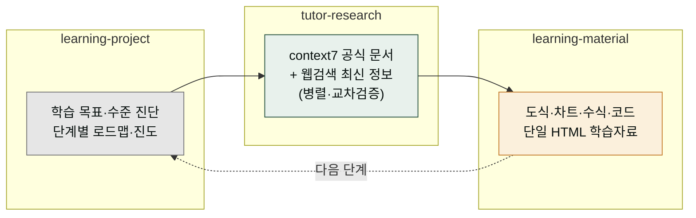

**릴리스 날짜**: 2026-06-16
**버전**: v2.20.0 (MINOR, 최신)
**업데이트 명령**: `/plugin marketplace update cowork-plugins`



## Highlights

v2.20.0은 **학습자(수강생) 전용 `moai-learning` 플러그인**을 새로 추가합니다. 가르치는 사람을 위한 `moai-education`과 분리된, **배우는 사람** 관점의 도메인입니다. (두 도메인은 현재 [`moai-tutor`](/moai-agents/tutor/) 한 명으로 통합되었습니다.)

학습 질문을 던지면 공식 문서(context7)와 웹검색을 **병렬로** 조사해 최신·정확한 근거를 모으고, 그 내용을 도식·차트·수식·코드 하이라이트가 들어간 한 편의 HTML 학습자료로 정리합니다. claude code·cowork·영어 등 어떤 주제든 스스로 깊이 학습하는 워크플로우입니다.

카운트 **27 → 28 플러그인 / 173 → 176 스킬**. 기능·인터페이스 Breaking change 없음. 더불어 저장소 라이선스가 **MIT → NC-ND 1.0**으로 전환됐고, `humanize-korean`이 MIT 차용 의존 없이 **자체 저작으로 재생성**(기능 동등)됐습니다.


**기존 워크플로우 그대로 동작합니다**: 신규 플러그인 추가만 있고 기존 플러그인·스킬·워크플로우는 변경되지 않았습니다.


## What's New

### moai-tutor — 학습자 개인 AI 튜터 (3 스킬)

| 스킬 | 용도 | 문서 |
|------|------|------|
| `learning-project` | 학습 목표·수준 진단, 단계별 로드맵(Bloom 6단계), 진도 추적·학습 전용 CLAUDE.md 스캐폴딩 | [SKILL.md](https://github.com/modu-ai/cowork-plugins/blob/main/moai-tutor/skills/learning-project/SKILL.md) |
| `tutor-research` | 질문을 리서치 축으로 분해 → context7 + 웹검색 병렬 조사·교차검증 → 출처 검증 종합본 | [SKILL.md](https://github.com/modu-ai/cowork-plugins/blob/main/moai-tutor/skills/tutor-research/SKILL.md) |
| `learning-material` | 학습목표·핵심개념·도식·예제·복습 구조의 단일 HTML. CDN 라이브러리 조건부 로딩 | [SKILL.md](https://github.com/modu-ai/cowork-plugins/blob/main/moai-tutor/skills/learning-material/SKILL.md) |

### context7 MCP 번들

`moai-tutor/.mcp.json`에 context7(`alwaysLoad`)을 번들해, 설치 시 라이브러리·SDK·CLI 공식 문서 조회가 함께 활성화됩니다. 별도 API 키가 필요 없습니다(npx 자동 설치).

### 2026 CDN 라이브러리 스택 큐레이션

`learning-material` 렌더러가 사용하는 영역별 최고 라이브러리를 [`references/cdn-libraries.md`](https://github.com/modu-ai/cowork-plugins/blob/main/moai-tutor/skills/learning-material/references/cdn-libraries.md)에 정리했습니다.

| 영역 | 채택 | 라이선스 |
|------|------|----------|
| 다이어그램 | Mermaid v11 | MIT |
| 차트 | Apache ECharts v5 | Apache-2.0 |
| 코드 하이라이트 | highlight.js v11 | BSD-3 |
| 수식 | KaTeX v0.16 | MIT |
| 스크롤 효과 | AOS v2 | MIT |

콘텐츠가 실제로 쓸 때만 주입하는 **조건부 로딩**(순수 텍스트 자료는 JS 0)이며, [`moai-officer:office-html-report`](/moai-agents/marketer/)의 0-JS 원칙은 그대로 보존합니다.

## 라이선스 전환 & humanize-korean 자체 재생성

이번 릴리스는 moai-tutor 신규 플러그인과 함께 두 가지 라이선스 정비를 포함합니다.

### MIT → NC-ND 1.0 라이선스 전환

저장소 라이선스를 **비상업·변경금지(Non-Commercial No-Derivatives) 1.0**으로 전환했습니다.

- 루트 `LICENSE` = NC-ND 1.0 (비상업 이용 + 변경 금지)
- 종전 MIT 릴리스는 `LICENSE.MIT`로 보존 — 해당 릴리스에 한해 MIT 조건이 계속 유효합니다
- 제3자 구성요소(Apache 2.0 · MIT · SIL OFL)는 `NOTICE.md`에 격리되어 각자의 원 라이선스가 우선합니다(LICENSE 제7조)
- 전체 28개 `plugin.json`이 `license: LicenseRef-MoAI-NC-ND-1.0`

### humanize-korean 라이선스 안전 자체 재생성

`moai-writer:general-humanize-korean` 스킬에 남아있던 외부 MIT 차용 의존을 **100% 제거**하고 자체 저작으로 재생성했습니다.

- **보존**: 검증된 10대 카테고리(A~J)·S1/S2/S3 심각도·CLI 인터페이스·등급 로직·워크플로
- **자체 저작**: 메트릭 알고리즘(metrics.py·metrics_v2.py)·테스트·taxonomy 예문·scholarship 산문·파생 룰북·SKILL.md 출처표시 전면 재작성
- **학술 기반**: 한국 번역학계 8유형 번역투 계보 + 학술 원전(KatFish·Toral 2019) 직접 인용 (언어 개념·학술 원전은 저작권 비대상)
- **기능 동등성**: 동일 risk_band·메트릭 값 byte-identical, 28 테스트 PASS — 기존 사용 결과는 그대로입니다


**기존 humanize-korean 사용 결과는 동일합니다**: 인터페이스·등급·메트릭 출력이 변하지 않으며, 라이선스만 NC-ND로 정리됐습니다.


## Changed

- **전체 버전 동기화 2.19.0 → 2.20.0** — marketplace.json + 28 plugin.json + 176 SKILL.md.
- 루트 README·`marketplace.json` 카탈로그에 moai-tutor 추가, 배지(28 플러그인 · 176 스킬)·총 산출물 표 갱신.

## Migration

- 신규 플러그인 추가만 있고 기존 플러그인·스킬·워크플로우는 변경되지 않습니다(기능적 비파괴).
- 마켓플레이스 캐시를 갱신한 뒤 `moai-tutor`를 설치하면 됩니다.

## 업그레이드 방법

1. **마켓플레이스 캐시 갱신**:

   ```text
   /plugin marketplace update cowork-plugins
   ```

2. **플러그인 설치** — `moai-coworker` 설치 후 `moai-tutor` 옆 **+** 버튼으로 설치하면 context7 MCP가 함께 활성화됩니다.

3. **API 키 재등록 불필요** — context7은 npx로 자동 설치되며 키가 필요 없습니다.

기존 워크플로우(v2.19.0까지)는 그대로 동작합니다.

## 사용 예시

```text
> claude code 서브에이전트 공부할 학습 프로젝트 만들어줘. 입문이고 하루 1시간.
→ learning-project → 수준 진단 → 단계별 로드맵 → 진도 추적·CLAUDE.md 생성
```

```text
> claude cowork Skills와 Sub-agents 차이를 최신 정보로 조사해서 HTML 학습자료로 만들어줘
→ tutor-research(context7 + 웹검색 병렬) → learning-material(시퀀스 도식 + 코드 HTML)
```

## 관련 문서 & 출처

- **CHANGELOG**: [전체 변경 사항](https://github.com/modu-ai/cowork-plugins/blob/main/CHANGELOG.md)
- **moai-tutor 플러그인 페이지**: [/moai-agents/tutor/](/moai-agents/tutor/)
- **moai-tutor 디렉터리**: [GitHub](https://github.com/modu-ai/cowork-plugins/tree/main/moai-tutor)
- **이전 릴리스 노트**: [v2.19.0](../v2.19/) · [v2.18.0](../v2.18/) · [v2.17.0](../v2.17/)
