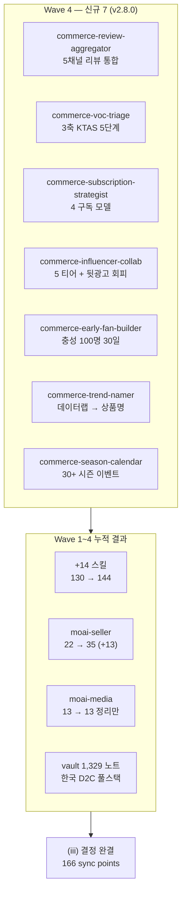

**릴리스 날짜**: 2026-05-16
**버전**: v2.8.0 (MINOR, 최신)
**업데이트 명령**: `/plugin marketplace update cowork-plugins`



## Highlights

v2.8.0은 **"Wave 4 — moai-seller 한국 D2C 풀스택 완결"** 출시입니다. Wave 1(vault grounding 신규 3) → Wave 2(보강 3) → Wave 3(신규 3) → Wave 4(신규 7)의 14주 작업 누적 결과 **(iii) 결정 완결**입니다.

이번 릴리스로 moai-seller는 한국 D2C 셀러가 (1) 멀티채널 리뷰 통합 분석, (2) VOC 응대 우선순위, (3) 구독 비즈니스 모델 설계, (4) 인플루언서 협업·뒷광고 회피, (5) 충성 100명 부트스트랩, (6) 트렌드 키워드 변환, (7) 연간 시즌 캘린더까지 한 플러그인 안에서 처리할 수 있습니다.

**Wave 1-4 누적 결과**:
- 마켓플레이스 130 → **144 스킬** (+14, 14주 작업)
- moai-seller 22 → **35 스킬** (+13)
- moai-media 13 → 13 스킬 (정리만, Quick Wins 6 + 안 C 책임 명확화 3)
- 어트리뷰션 정책 변경 완료: 정승우님 자료 출처 모두 제거 (내용 보존)
- vault grounding: 1,329 노트 기반 한국 D2C·CRM·LTV·법규 풀스택

마켓플레이스 137 → **144 스킬**. 동기화 지점 159 → **166**. Breaking change 없음.

## What's New

### moai-seller 신규 7 스킬

**`commerce-review-aggregator`** — 멀티채널 리뷰 통합 분석

- **SKILL.md GitHub URL**: [moai-seller/skills/commerce-review-aggregator/SKILL.md](https://github.com/modu-ai/cowork-plugins/blob/main/moai-seller/skills/commerce-review-aggregator/SKILL.md)

핵심 기능: 네이버 스마트스토어·쿠팡·자사몰·YouTube·인스타그램 5채널 → 감정·키워드·인사이트·액션플랜 4단 분석. 채널별 수집 가이드(API·CSV·Graph API). 미리캔버스 PPT 자동화.

**`commerce-voc-triage`** — VOC 우선순위 판별

- **SKILL.md GitHub URL**: [moai-seller/skills/commerce-voc-triage/SKILL.md](https://github.com/modu-ai/cowork-plugins/blob/main/moai-seller/skills/commerce-voc-triage/SKILL.md)

핵심 기능: 3축 분류(고객 핏 ×1-3 / 빈도 ×1-3 / 핵심 가치 관련성 ×1-3) + 우선순위 점수(3축 곱) + KTAS 응급실 5단계 매핑(Level 1 즉시 <1시간 / Level 5 비응급 <1주). 등급별 응답 톤·내용 가이드.

**`commerce-subscription-strategist`** — 구독 비즈니스 모델 설계

- **SKILL.md GitHub URL**: [moai-seller/skills/commerce-subscription-strategist/SKILL.md](https://github.com/modu-ai/cowork-plugins/blob/main/moai-seller/skills/commerce-subscription-strategist/SKILL.md)

핵심 기능: 5가지 질문 자기진단(소비 빈도·가격 예측·락인 가치·이탈 방지·시장 검증) + 4 구독 모델 분류(소비재 오이식스 / 경험 VIPS / 관계 쿠팡 로켓와우 / 맞춤 필리) + 한국 시장 적합성 4단계 진단 + 락인 vs 이탈 방지 메시지 매트릭스 6단계.

**`commerce-influencer-collab`** — 인플루언서·UGC 협업 가이드

- **SKILL.md GitHub URL**: [moai-seller/skills/commerce-influencer-collab/SKILL.md](https://github.com/modu-ai/cowork-plugins/blob/main/moai-seller/skills/commerce-influencer-collab/SKILL.md)
- **공식 외부 참고**: [공정거래위원회 표시·광고 심사지침](https://www.ftc.go.kr) (뒷광고 회피)

핵심 기능: 5 티어(메가 100만+ / 매크로 10-100만 / 마이크로 1-10만 / 나노 1천-1만 / 메가나노 1천 미만) × 협업 비용·전환율 매트릭스 + 뒷광고 회피 체크리스트 6항목(표시광고법 + 공정위 가이드) + UGC 리그램 가이드 + 5축 굿즈 기획. 과태료 5,000만원 회피.

**`commerce-early-fan-builder`** — 신생 브랜드 충성 100명 부트스트랩

- **SKILL.md GitHub URL**: [moai-seller/skills/commerce-early-fan-builder/SKILL.md](https://github.com/modu-ai/cowork-plugins/blob/main/moai-seller/skills/commerce-early-fan-builder/SKILL.md)

핵심 기능: 5원칙(광고 0원·1:1 손편지·UGC 100%·비공개 채널·추천 시스템) + 30일 로드맵(시드 50명 → 100명 → 락인 → 추천) + 100명→1만명 전환 시나리오 + 핵심 지표(재구매율 80%+·평균 10명 추천·LTV/CAC ratio 3+). 블랭크·강아지 가방 케이스.

**`commerce-trend-namer`** — 네이버 데이터랩 트렌드 변환

- **SKILL.md GitHub URL**: [moai-seller/skills/commerce-trend-namer/SKILL.md](https://github.com/modu-ai/cowork-plugins/blob/main/moai-seller/skills/commerce-trend-namer/SKILL.md)
- **공식 외부 참고**: [네이버 데이터랩](https://datalab.naver.com)

핵심 기능: 카테고리별 급상승 검색어·시즌 트렌드 수집 → 상품명 변형 3안 + 해시태그 세트 30개(카테고리 5·트렌드 10·브랜드 5·일반 10) + 블로그 제목 SEO 3안(C-Rank 친화). 페어 분리: `commerce-product-naming` = SEO 상품명 표준 생성, 본 스킬 = 트렌드 키워드 흡수 변환.

**`commerce-season-calendar`** — 연간 시즌 캘린더

- **SKILL.md GitHub URL**: [moai-seller/skills/commerce-season-calendar/SKILL.md](https://github.com/modu-ai/cowork-plugins/blob/main/moai-seller/skills/commerce-season-calendar/SKILL.md)

핵심 기능: 한국·글로벌 30+ 시즌 이벤트(1분기 설날·발렌타인·졸업입학 / 2분기 가정의 달·여름 / 3분기 휴가·추석 / 4분기 빼빼로·블프·솽스이·크리스마스) + 카테고리별 매출 피크 매핑(화장품·식품·의류·반려동물·여행) + 분기 캠페인 사전 준비 계획(D-30/D-60/D-90/D-120).

## Changed

- 마켓플레이스 스킬 카운트: 137 → **144** (+7 신규)
- 동기화 지점: 159 → **166** (marketplace 1 + plugin.json 21 + SKILL.md 144)
- `moai-seller` plugin.json `description` v2.8.0 신규 항목 추가
- `marketplace.json` `plugins[]` 배열의 `moai-seller` description 갱신
- 루트 README 배지(Version 2.8.0 · Skills 144) + 하이라이트 섹션
- `moai-seller/README.md` 스킬 테이블 신규 7 행 추가
- docs-site `_index.md` 카운트 130 → 144 + 최근 릴리스 카드 v2.8/v2.7/v2.6 추가 (본 릴리스 후속 보강)
- docs-site `plugins/moai-seller.md` 22 → 35 + Wave 1-4 신규 13 섹션 추가 (본 릴리스 후속 보강)

## Fixed

해당 없음.

## Removed

해당 없음. Breaking change 없음 — 기존 워크플로우 그대로 동작.

## 업그레이드 방법

1. **마켓플레이스 캐시 갱신**:

   ```text
   /plugin marketplace update cowork-plugins
   ```

2. **`moai-seller` 플러그인 상세 재진입** — 새 스킬 7종이 자동 감지됩니다.

3. **채널별 API 키 (선택)** — `commerce-review-aggregator`는 다음 API 키가 있어야 자동 수집:
   - 네이버 커머스 API · 쿠팡 윙 API · 카페24 API · YouTube Data API · Instagram Graph API
   - 미설정 시 CSV 업로드 fallback 자동 동작

4. **트렌드 데이터** — `commerce-trend-namer`는 [네이버 데이터랩](https://datalab.naver.com) 공개 데이터를 사용. 별도 API 키 불필요.

기존 워크플로우(v2.7.0까지의 Wave 1-3 포함)는 그대로 동작합니다.

## 사용 예시

```text
> 우리 상품 5채널 리뷰 통합 분석해줘. 네이버 + 쿠팡 + 자사몰 CSV 첨부.
→ commerce-review-aggregator → 감정·키워드·인사이트·액션플랜 4단 → 미리캔버스 PPT
```

```text
> VOC 우선순위 매겨줘. 이번주 들어온 컴플레인 23건.
→ commerce-voc-triage → 3축 분류 → KTAS 5단계 → Level 1~5 응대 가이드
```

```text
> 우리 화장품 D2C 구독 모델 만들 수 있을까?
→ commerce-subscription-strategist → 5가지 질문 자기진단 → 4 모델 매칭 → 락인·이탈 메시지 매트릭스
```

```text
> 마이크로 인플루언서 협업 가이드 만들어줘. 비건 카테고리, 예산 500만원.
→ commerce-influencer-collab → 5 티어 매칭 → 비용·전환율 매트릭스 → 뒷광고 회피 6항목 체크리스트
```

```text
> 신생 브랜드 충성 100명 만들고 싶어. 30일 로드맵 짜줘.
→ commerce-early-fan-builder → 5원칙 + 30일 로드맵 → 100명→1만명 전환 시나리오
```

```text
> 이번주 트렌드 상품명·해시태그 만들어줘. 비건 스킨케어 카테고리.
→ commerce-trend-namer → 데이터랩 급상승 → 상품명 3안 + 해시태그 30개 + 블로그 제목 3안
```

```text
> 우리 카테고리 4분기 시즌 캠페인 사전 준비 계획 짜줘. 화장품.
→ commerce-season-calendar → 4분기 빼빼로·블프·솽스이·크리스마스 → D-30/D-60/D-90/D-120 액션 플랜
```

## 관련 문서 & 출처

- **CHANGELOG**: [전체 변경 사항](https://github.com/modu-ai/cowork-plugins/blob/main/CHANGELOG.md#280---2026-05-16)
- **moai-seller 플러그인 페이지**: [/moai-agents/seller/](/moai-agents/seller/)
- **공정거래위원회 표시·광고 심사지침**: [ftc.go.kr](https://www.ftc.go.kr) (뒷광고 회피)
- **네이버 데이터랩**: [datalab.naver.com](https://datalab.naver.com)
- **KTAS 응급실 5단계 매핑**: 한국 응급의학회 분류 체계 차용
- **vault grounding 명세**: `research-2026-05-16/vault-ecom.md` §A-3 MED-1-5 + LOW-1-2
- **이전 릴리스 노트**: [v2.7.0](../v2.7/) · [v2.6.x](../v2.6/) · [v2.5.0](../v2.5/)

## Wave 1-4 누적 결과 ((iii) 결정 완결)

| 항목 | v2.5.0 시점 | v2.8.0 시점 | 증분 |
|------|------------|------------|------|
| 마켓플레이스 스킬 | 130 | **144** | +14 |
| moai-seller 스킬 | 22 | **35** | +13 |
| moai-media 스킬 | 13 | 13 | 정리만 |
| 동기화 지점 | 152 | **166** | +14 |
| 어트리뷰션 정책 | 정승우님 자료 표기 | 출처 제거(내용 보존) | 변경 |

## 후속 (별도 결정)

- Wave 5 후보 1: `moai-marketer` 보강 — CRM·콘텐츠 마케팅·B2B 광고 등 vault grounding 미적용 스킬
- Wave 5 후보 2: `moai-marketer` 신규 — humanize-korean 외 추가 한국어 콘텐츠 도구
- 또는 사용자 검증 사이클 (실제 사용 → 보강·정정)
